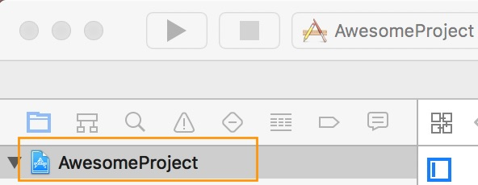
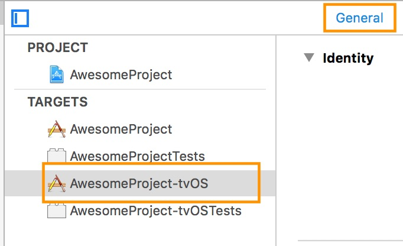
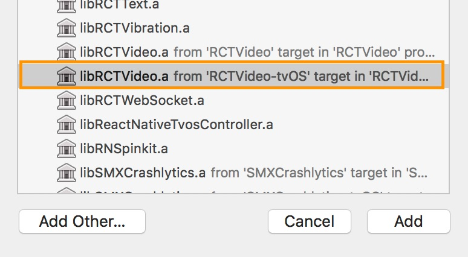
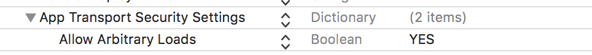

## react-native-video

A `<Video>` component for react-native, as seen in
[react-native-login](https://github.com/brentvatne/react-native-login)!

Requires react-native >= 0.40.0, for RN support of 0.19.0 - 0.39.0 please use a pre 1.0 version.

### Version 3.0 breaking changes
Version 3.0 features a number of changes to existing behavior. See [Updating](#updating) for changes.

## TOC

* [Installation](#installation)
* [Usage](#usage)
* [Updating](#updating)

## Installation

Using npm:

```shell
npm install --save react-native-video
```

or using yarn:

```shell
yarn add react-native-video
```

<details>
  <summary>iOS</summary>

Run `react-native link react-native-video` to link the react-native-video library.

If you would like to allow other apps to play music over your video component, add:

**AppDelegate.m**

```objective-c
#import <AVFoundation/AVFoundation.h>  // import

- (BOOL)application:(UIApplication *)application didFinishLaunchingWithOptions:(NSDictionary *)launchOptions
{
  ...
  [[AVAudioSession sharedInstance] setCategory:AVAudioSessionCategoryAmbient error:nil];  // allow
  ...
}
```
Note: you can also use the `ignoreSilentSwitch` prop, shown below.
</details>

<details>
  <summary>tvOS</summary>
  
`react-native link react-native-video` doesn’t work properly with the tvOS target so we need to add the library manually.

First select your project in Xcode.



After that, select the tvOS target of your application and select « General » tab



Scroll to « Linked Frameworks and Libraries » and tap on the + button


Select RCTVideo-tvOS


</details>

<details>
  <summary>Android</summary>

Run `react-native link react-native-video` to link the react-native-video library.

Or if you have trouble, make the following additions to the given files manually:

**android/settings.gradle**

The newer ExoPlayer library will work for most people.

```gradle
include ':react-native-video'
project(':react-native-video').projectDir = new File(rootProject.projectDir, '../node_modules/react-native-video/android-exoplayer')
```

If you need to use the old Android MediaPlayer based player, use the following instead:

```gradle
include ':react-native-video'
project(':react-native-video').projectDir = new File(rootProject.projectDir, '../node_modules/react-native-video/android')
```


**android/app/build.gradle**

```gradle
dependencies {
   ...
   compile project(':react-native-video')
}
```

**MainApplication.java**

On top, where imports are:

```java
import com.brentvatne.react.ReactVideoPackage;
```

Add the `ReactVideoPackage` class to your list of exported packages.

```java
@Override
protected List<ReactPackage> getPackages() {
    return Arrays.asList(
            new MainReactPackage(),
            new ReactVideoPackage()
    );
}
```
</details>

<details>
  <summary>Windows</summary>

Make the following additions to the given files manually:

**windows/myapp.sln**

Add the `ReactNativeVideo` project to your solution.

1. Open the solution in Visual Studio 2015
2. Right-click Solution icon in Solution Explorer > Add > Existing Project
  * UWP: Select `node_modules\react-native-video\windows\ReactNativeVideo\ReactNativeVideo.csproj`
  * WPF: Select `node_modules\react-native-video\windows\ReactNativeVideo.Net46\ReactNativeVideo.Net46.csproj`

**windows/myapp/myapp.csproj**

Add a reference to `ReactNativeVideo` to your main application project. From Visual Studio 2015:

1. Right-click main application project > Add > Reference...
  * UWP: Check `ReactNativeVideo` from Solution Projects.
  * WPF: Check `ReactNativeVideo.Net46` from Solution Projects.

**MainPage.cs**

Add the `ReactVideoPackage` class to your list of exported packages.
```cs
using ReactNative;
using ReactNative.Modules.Core;
using ReactNative.Shell;
using ReactNativeVideo; // <-- Add this
using System.Collections.Generic;
...

        public override List<IReactPackage> Packages
        {
            get
            {
                return new List<IReactPackage>
                {
                    new MainReactPackage(),
                    new ReactVideoPackage(), // <-- Add this
                };
            }
        }

...
```
</details>

## Usage

```javascript
// Load the module

import Video from 'react-native-video';

// Within your render function, assuming you have a file called
// "background.mp4" in your project. You can include multiple videos
// on a single screen if you like.

<Video source={{uri: "background"}}   // Can be a URL or a local file.
       ref={(ref) => {
         this.player = ref
       }}                                      // Store reference
       onBuffer={this.onBuffer}                // Callback when remote video is buffering
       onEnd={this.onEnd}                      // Callback when playback finishes
       onError={this.videoError}               // Callback when video cannot be loaded
       style={styles.backgroundVideo} />

// Later on in your styles..
var styles = StyleSheet.create({
  backgroundVideo: {
    position: 'absolute',
    top: 0,
    left: 0,
    bottom: 0,
    right: 0,
  },
});
```

### Configurable props
* [allowsExternalPlayback](#allowsexternalplayback)
* [audioOnly](#audioonly)
* [bufferConfig](#bufferconfig)
* [ignoreSilentSwitch](#ignoresilentswitch)
* [muted](#muted)
* [paused](#paused)
* [playInBackground](#playinbackground)
* [playWhenInactive](#playwheninactive)
* [poster](#poster)
* [posterResizeMode](#posterresizemode)
* [progressUpdateInterval](#progressupdateinterval)
* [rate](#rate)
* [repeat](#repeat)
* [resizeMode](#resizemode)
* [selectedAudioTrack](#selectedaudiotrack)
* [selectedTextTrack](#selectedtexttrack)
* [stereoPan](#stereopan)
* [textTracks](#texttracks)
* [useTextureView](#usetextureview)
* [volume](#volume)

### Event props
* [onAudioBecomingNoisy](#onaudiobecomingnoisy)
* [onFullscreenPlayerWillPresent](#onfullscreenplayerwillpresent)
* [onFullscreenPlayerDidPresent](#onfullscreenplayerdidpresent)
* [onFullscreenPlayerWillDismiss](#onfullscreenplayerwilldismiss)
* [onFullscreenPlayerDidDismiss](#onfullscreenplayerdiddismiss)
* [onLoad](#onload)
* [onLoadStart](#onloadstart)
* [onProgress](#onprogress)
* [onTimedMetadata](#ontimedmetadata)

### Methods
* [dismissFullscreenPlayer](#dismissfullscreenplayer)
* [presentFullscreenPlayer](#presentfullscreenplayer)
* [seek](#seek)

### Configurable props

#### allowsExternalPlayback
Indicates whether the player allows switching to external playback mode such as AirPlay or HDMI.
* **true (default)** - allow switching to external playback mode
* **false** -  Don't allow switching to external playback mode

Platforms: iOS

#### audioOnly
Indicates whether the player should only play the audio track and instead of displaying the video track, show the poster instead.
* **false (default)** - Display the video as normal
* **true** - Show the poster and play the audio

For this to work, the poster prop must be set.

Platforms: all

#### bufferConfig
Adjust the buffer settings. This prop takes an object with one or more of the properties listed below.

Property | Type | Description
--- | --- | ---
minBufferMs | number | The default minimum duration of media that the player will attempt to ensure is buffered at all times, in milliseconds.
maxBufferMs | number | The default maximum duration of media that the player will attempt to buffer, in milliseconds.
bufferForPlaybackMs | number | The default duration of media that must be buffered for playback to start or resume following a user action such as a seek, in milliseconds.
playbackAfterRebufferMs | number | The default duration of media that must be buffered for playback to resume after a rebuffer, in milliseconds. A rebuffer is defined to be caused by buffer depletion rather than a user action.

This prop should only be set when you are setting the source, changing it after the media is loaded will cause it to be reloaded.

Example with default values:
```
bufferConfig={{
  minBufferMs: 15000,
  maxBufferMs: 50000,
  bufferForPlaybackMs: 2500,
  bufferForPlaybackAfterRebufferMs: 5000
}}
```

Platforms: Android ExoPlayer

#### ignoreSilentSwitch
Controls the iOS silent switch behavior
* **"inherit" (default)** - Use the default AVPlayer behavior
* **"ignore"** - Play audio even if the silent switch is set
* **"obey"** - Don't play audio if the silent switch is set

Platforms: iOS

#### muted
Controls whether the audio is muted
* **false (default)** - Don't mute audio
* **true** - Mute audio

Platforms: all

#### paused
Controls whether the media is paused
* **false (default)** - Don't pause the media
* **true** - Pause the media

Platforms: all

#### playInBackground
Determine whether the media should continue playing while the app is in the background. This allows customers to continue listening to the audio.
* **false (default)** - Don't continue playing the media
* **true** - Continue playing the media

To use this feature on iOS, you must:
* [Enable Background Audio](https://developer.apple.com/library/archive/documentation/Audio/Conceptual/AudioSessionProgrammingGuide/AudioSessionBasics/AudioSessionBasics.html#//apple_ref/doc/uid/TP40007875-CH3-SW3) in your Xcode project
* Set the ignoreSilentSwitch prop to "ignore"

Platforms: Android ExoPlayer, Android MediaPlayer, iOS

#### playWhenInactive
Determine whether the media should continue playing when notifications or the Control Center are in front of the video.
* **false (default)** - Don't continue playing the media
* **true** - Continue playing the media

Platforms: iOS

#### poster
An image to display while the video is loading
<br>Value: string with a URL for the poster, e.g. "https://baconmockup.com/300/200/"

Platforms: all

#### posterResizeMode
Determines how to resize the poster image when the frame doesn't match the raw video dimensions.
* **"contain" (default)** - Scale the image uniformly (maintain the image's aspect ratio) so that both dimensions (width and height) of the image will be equal to or less than the corresponding dimension of the view (minus padding).
* **"center"** - Center the image in the view along both dimensions. If the image is larger than the view, scale it down uniformly so that it is contained in the view.
* **"cover"** - Scale the image uniformly (maintain the image's aspect ratio) so that both dimensions (width and height) of the image will be equal to or larger than the corresponding dimension of the view (minus padding).
* **"none"** - Don't apply resize
* **"repeat"** - Repeat the image to cover the frame of the view. The image will keep its size and aspect ratio. (iOS only)
* **"stretch"** - Scale width and height independently, This may change the aspect ratio of the src.

Platforms: all

#### progressUpdateInterval
Delay in milliseconds between onProgress events in milliseconds.

Default: 250.0

Platforms: all

### rate
Speed at which the media should play. 
* **0.0** - Pauses the video
* **1.0** - Play at normal speed
* **Other values** - Slow down or speed up playback

Platforms: all

Note: For Android MediaPlayer, rate is only supported on Android 6.0 and higher devices.

#### repeat
Determine whether to repeat the video when the end is reached
* **false (default)** - Don't repeat the video
* **true** - Repeat the video

Platforms: all

#### resizeMode
Determines how to resize the video when the frame doesn't match the raw video dimensions.
* **"none" (default)** - Don't apply resize
* **"contain"** - Scale the video uniformly (maintain the video's aspect ratio) so that both dimensions (width and height) of the video will be equal to or less than the corresponding dimension of the view (minus padding).
* **"cover"** - Scale the video uniformly (maintain the video's aspect ratio) so that both dimensions (width and height) of the image will be equal to or larger than the corresponding dimension of the view (minus padding).
* **"stretch"** - Scale width and height independently, This may change the aspect ratio of the src.

Platforms: Android ExoPlayer, Android MediaPlayer, iOS, Windows UWP

#### selectedAudioTrack
Configure which audio track, if any, is played.

```
selectedAudioTrack={{
  type: Type,
  value: Value
}}
```

Example:
```
selectedAudioTrack={{
  type: "title",
  value: "Dubbing"
}}
```

Type | Value | Description
--- | --- | ---
"system" (default) | N/A | Play the audio track that matches the system language. If none match, play the first track.
"disabled" | N/A | Turn off audio
"title" | string | Play the audio track with the title specified as the Value, e.g. "French"
"language" | string | Play the audio track with the language specified as the Value, e.g. "fr"
"index" | number | Play the audio track with the index specified as the value, e.g. 0

If a track matching the specified Type (and Value if appropriate) is unavailable, the first audio track will be played. If multiple tracks match the criteria, the first match will be used.

Platforms: Android ExoPlayer, iOS

#### selectedTextTrack
Configure which text track (caption or subtitle), if any, is shown.

```
selectedTextTrack={{
  type: Type,
  value: Value
}}
```

Example:
```
selectedTextTrack={{
  type: "title",
  value: "English Subtitles"
}}
```

Type | Value | Description
--- | --- | ---
"system" (default) | N/A | Display captions only if the system preference for captions is enabled
"disabled" | N/A | Don't display a text track
"title" | string | Display the text track with the title specified as the Value, e.g. "French 1"
"language" | string | Display the text track with the language specified as the Value, e.g. "fr"
"index" | number | Display the text track with the index specified as the value, e.g. 0

Both iOS & Android (only 4.4 and higher) offer Settings to enable Captions for hearing impaired people. If "system" is selected and the Captions Setting is enabled, iOS/Android will look for a caption that matches that customer's language and display it. 

If a track matching the specified Type (and Value if appropriate) is unavailable, no text track will be displayed. If multiple tracks match the criteria, the first match will be used.

Platforms: Android ExoPlayer, iOS

#### stereoPan
Adjust the balance of the left and right audio channels.  Any value between –1.0 and 1.0 is accepted.
* **-1.0** - Full left
* **0.0 (default)** - Center
* **1.0** - Full right

Platforms: Android MediaPlayer

#### textTracks
Load one or more "sidecar" text tracks. This takes an array of objects representing each track. Each object should have the format:

Property | Description
--- | ---
title | Descriptive name for the track
language | 2 letter [ISO 639-1 code](https://en.wikipedia.org/wiki/List_of_ISO_639-1_codes) representing the language
type | Mime type of the track<br> * TextTrackType.SRT - SubRip (.srt)<br> * TextTrackType.TTML - TTML (.ttml)<br> * TextTrackType.VTT - WebVTT (.vtt)<br>iOS only supports VTT, Android ExoPlayer supports all 3
uri | URL for the text track. Currently, only tracks hosted on a webserver are supported

On iOS, sidecar text tracks are only supported for individual files, not HLS playlists. For HLS, you should include the text tracks as part of the playlist.

Example:
```
import { TextTrackType }, Video from 'react-native-video';

textTracks={[
  {
    title: "English CC",
    language: "en",
    type: TextTrackType.VTT, // "text/vtt"
    uri: "https://bitdash-a.akamaihd.net/content/sintel/subtitles/subtitles_en.vtt"
  },
  {
    title: "Spanish Subtitles",
    language: "es",
    type: TextTrackType.SRT, // "application/x-subrip"
    uri: "https://durian.blender.org/wp-content/content/subtitles/sintel_es.srt"
  }
]}
```


Platforms: Android ExoPlayer, iOS

#### useTextureView
Output to a TextureView instead of the default SurfaceView. In general, you will want to use SurfaceView because it is more efficient and provides better performance. However, SurfaceViews has two limitations:
* It can't be animated, transformed or scaled
* You can't overlay multiple SurfaceViews

useTextureView can only be set at same time you're setting the source.

* **false (default)** - Use a SurfaceView
* **true** - Use a TextureView

Platforms: Android ExoPlayer

#### volume
Adjust the volume.
* **1.0 (default)** - Play at full volume
* **0.0** - Mute the audio
* **Other values** - Reduce volume

Platforms: all

### Event props

#### onAudioBecomingNoisy
Callback function that is called when the audio is about to become 'noisy' due to a change in audio outputs. Typically this is called when audio output is being switched from an external source like headphones back to the internal speaker. It's a good idea to pause the media when this happens so the speaker doesn't start blasting sound.

Payload: none

Platforms: Android ExoPlayer, iOS

#### onFullscreenPlayerWillPresent
Callback function that is called when the player is about to enter fullscreen mode.

Payload: none

Platforms: Android ExoPlayer, Android MediaPlayer, iOS

#### onFullscreenPlayerDidPresent
Callback function that is called when the player has entered fullscreen mode.

Payload: none

Platforms: Android ExoPlayer, Android MediaPlayer, iOS

#### onFullscreenPlayerWillDismiss
Callback function that is called when the player is about to exit fullscreen mode.

Payload: none

Platforms: Android ExoPlayer, Android MediaPlayer, iOS

#### onFullscreenPlayerDidDismiss
Callback function that is called when the player has exited fullscreen mode.

Payload: none

Platforms: Android ExoPlayer, Android MediaPlayer, iOS

#### onLoad
Callback function that is called when the media is loaded and ready to play.

Payload:

Property | Type | Description
--- | --- | ---
currentPosition | number | Time in seconds where the media will start
duration | number | Length of the media in seconds
naturalSize | object | Properties:<br> * width - Width in pixels that the video was encoded at<br> * height - Height in pixels that the video was encoded at<br> * orientation - "portrait" or "landscape"
audioTracks | array | An array of audio track info objects with the following properties:<br> * index - Index number<br> * title - Description of the track<br> * language - 2 letter [ISO 639-1](https://en.wikipedia.org/wiki/List_of_ISO_639-1_codes) or 3 letter [ISO639-2](https://en.wikipedia.org/wiki/List_of_ISO_639-2_codes) language code<br> * type - Mime type of track
textTracks | array | An array of text track info objects with the following properties:<br> * index - Index number<br> * title - Description of the track<br> * language - 2 letter [ISO 639-1](https://en.wikipedia.org/wiki/List_of_ISO_639-1_codes) or 3 letter [ISO 639-2](https://en.wikipedia.org/wiki/List_of_ISO_639-2_codes) language code<br> * type - Mime type of track

Example:
```
{ 
  canPlaySlowForward: true,
  canPlayReverse: false,
  canPlaySlowReverse: false,
  canPlayFastForward: false,
  canStepForward: false,
  canStepBackward: false,
  currentTime: 0,
  duration: 5910.208984375,
  naturalSize: {
     height: 1080
     orientation: 'landscape'
     width: '1920'
  },
  audioTracks: [
    { language: 'es', title: 'Spanish', type: 'audio/mpeg', index: 0 },
    { language: 'en', title: 'English', type: 'audio/mpeg', index: 1 }
  ],
  textTracks: [
    { title: '#1 French', language: 'fr', index: 0, type: 'text/vtt' },
    { title: '#2 English CC', language: 'en', index: 1, type: 'text/vtt' },
    { title: '#3 English Director Commentary', language: 'en', index: 2, type: 'text/vtt' }
  ]
}
```

Platforms: all

#### onLoadStart
Callback function that is called when the media starts loading.

Payload:

Property | Description
--- | ---
isNetwork | boolean | Boolean indicating if the media is being loaded from the network
type | string | Type of the media. Not available on Windows
uri | string | URI for the media source. Not available on Windows

Example:
```
{
  isNetwork: true,
  type: '',
  uri: 'https://bitdash-a.akamaihd.net/content/sintel/hls/playlist.m3u8'
}
```

Platforms: all

#### onProgress
Callback function that is called every progressInterval seconds with info about which position the media is currently playing.

Property | Description
--- | ---
currentTime | number | Current position in seconds
playableDuration | number | Position to where the media can be played to using just the buffer in seconds
seekableDuration | number | Position to where the media can be seeked to in seconds. Typically, the total length of the media

Example:
```
{
  currentTime: 5.2,
  playableDuration: 34.6,
  seekableDuration: 888
}
```

#### onTimedMetadata
Callback function that is called when timed metadata becomes available

Payload:

Property | Type | Description
--- | --- | ---
metadata | array | Array of metadata objects

Example:
```
{
  metadata: [
    { value: 'Streaming Encoder', identifier: 'TRSN' },
    { value: 'Internet Stream', identifier: 'TRSO' },
    { value: 'Any Time You Like', identifier: 'TIT2' }
  ]
}
```

Platforms: Android ExoPlayer, iOS

### Methods
Methods operate on a ref to the Video element. You can create a ref using code like:
```
return (
  <Video source={...}
    ref => (this.player = ref) />
);
```

#### dismissFullscreenPlayer
`dismissFullscreenPlayer()`

Take the player out of fullscreen mode.

Example:
```
this.player.dismissFullscreenPlayer();
```

Platforms: Android ExoPlayer, Android MediaPlayer, iOS

#### FullscreenPlayer
`presentFullscreenPlayer()`

Put the player in fullscreen mode.

On iOS, this displays the video in a fullscreen view controller with controls.

On Android ExoPlayer & MediaPlayer, this puts the navigation controls in fullscreen mode. It is not a complete fullscreen implementation, so you will still need to apply a style that makes the width and height match your screen dimensions to get a fullscreen video.

Example:
```
this.player.presentFullscreenPlayer();
```

Platforms: Android ExoPlayer, Android MediaPlayer, iOS

#### seek()
`seek(seconds)`

Seek to the specified position represented by seconds. seconds is a float value.

`seek()` can only be called after the `onLoad` event has fired.

Example:
```
this.player.seek(200); // Seek to 3 minutes, 20 seconds
```

Platforms: all

##### Exact seek

By default iOS seeks within 100 milliseconds of the target position. If you need more accuracy, you can use the seek with tolerance method:

`seek(seconds, tolerance)`

tolerance is the max distance in milliseconds from the seconds position that's allowed. Using a more exact tolerance can cause seeks to take longer. If you want to seek exactly, set tolerance to 0.

Example:
```
this.player.seek(120, 50); // Seek to 2 minutes with +/- 50 milliseconds accuracy
```

Platforms: iOS


### Additional props

To see the full list of available props, you can check the [propTypes](https://github.com/react-native-community/react-native-video/blob/master/Video.js#L246) of the Video.js component.

- By default, iOS 9+ will only load encrypted HTTPS urls. If you need to load content from a webserver that only supports HTTP, you will need to modify your Info.plist file and add the following entry:



For more detailed info check this [article](https://cocoacasts.com/how-to-add-app-transport-security-exception-domains)
</details>

### Android Expansion File Usage
Expansions files allow you to ship assets that exceed the 100MB apk size limit and don't need to be updated each time you push an app update.

This only supports mp4 files and they must not be compressed. Example command line for preventing compression:
```bash
zip -r -n .mp4 *.mp4 player.video.example.com
```

```javascript
// Within your render function, assuming you have a file called
// "background.mp4" in your expansion file. Just add your main and (if applicable) patch version
<Video source={{uri: "background", mainVer: 1, patchVer: 0}} // Looks for .mp4 file (background.mp4) in the given expansion version.
       resizeMode="cover"           // Fill the whole screen at aspect ratio.
       style={styles.backgroundVideo} />

### Load files with the RN Asset System

The asset system [introduced in RN `0.14`](http://www.reactnative.com/react-native-v0-14-0-released/) allows loading image resources shared across iOS and Android without touching native code. As of RN `0.31` [the same is true](https://github.com/facebook/react-native/commit/91ff6868a554c4930fd5fda6ba8044dbd56c8374) of mp4 video assets for Android. As of [RN `0.33`](https://github.com/facebook/react-native/releases/tag/v0.33.0) iOS is also supported. Requires `react-native-video@0.9.0`.

```
<Video
  source={require('../assets/video/turntable.mp4')}
/>
```

### Play in background on iOS

To enable audio to play in background on iOS the audio session needs to be set to `AVAudioSessionCategoryPlayback`. See [Apple documentation][3] for additional details. (NOTE: there is now a ticket to [expose this as a prop]( https://github.com/react-native-community/react-native-video/issues/310) )

## Examples

- See an [Example integration][1] in `react-native-login` *note that this example uses an older version of this library, before we used `export default` -- if you use `require` you will need to do `require('react-native-video').default` as per instructions above.*
- Try the included [VideoPlayer example][2] yourself:

   ```sh
   git clone git@github.com:react-native-community/react-native-video.git
   cd react-native-video/example
   npm install
   open ios/VideoPlayer.xcodeproj

   ```

   Then `Cmd+R` to start the React Packager, build and run the project in the simulator.

- [Lumpen Radio](https://github.com/jhabdas/lumpen-radio) contains another example integration using local files and full screen background video.

## Updating

### Version 3.0

#### All platforms now auto-play
Previously, on Android ExoPlayer if the paused prop was not set, the media would not automatically start playing. The only way it would work was if you set `paused={false}`. This has been changed to automatically play if paused is not set so that the behavior is consistent across platforms.

#### All platforms now keep their paused state when returning from the background
Previously, on Android MediaPlayer if you setup an AppState event when the app went into the background and set a paused prop so that when you returned to the app the video would be paused it would be ignored.

Note, Windows does not have a concept of an app going into the background, so this doesn't apply there.

#### Use Android SDK 27 by default
Version 3.0 updates the Android build tools and SDK to version 27. React Native is in the process of [switchting over](https://github.com/facebook/react-native/issues/18095#issuecomment-395596130) to SDK 27 in preparation for Google's requirement that new Android apps [use SDK 26](https://android-developers.googleblog.com/2017/12/improving-app-security-and-performance.html) by August 2018.

You will either need to install the version 27 SDK and version 27.0.3 buildtools or modify your build.gradle file to configure react-native-video to use the same build settings as the rest of your app as described below.

##### Using app build settings
You will need to create a `project.ext` section in the top-level build.gradle file (not app/build.gradle). Fill in the values from the example below using the values found in your app/build.gradle file.
```
// Top-level build file where you can add configuration options common to all sub-projects/modules.

buildscript {
    ... // Various other settings go here
}

allprojects {
    ... // Various other settings go here

    project.ext {
        compileSdkVersion = 23
        buildToolsVersion = "23.0.1"

        minSdkVersion = 16
        targetSdkVersion = 22
    }
}
```

If you encounter an error `Could not find com.android.support:support-annotations:27.0.0.` reinstall your Android Support Repository.

## TODOS

- [ ] Add support for playing multiple videos in a sequence (will interfere with current `repeat` implementation)
- [x] Callback to get buffering progress for remote videos
- [ ] Bring API closer to HTML5 `<Video>` [reference](http://devdocs.io/html/element/video)

[1]: https://github.com/brentvatne/react-native-login/blob/56c47a5d1e23781e86e19b27e10427fd6391f666/App/Screens/UserInfoScreen.js#L32-L35
[2]: https://github.com/react-native-community/react-native-video/tree/master/example
[3]: https://developer.apple.com/library/ios/qa/qa1668/_index.html

---

**MIT Licensed**
