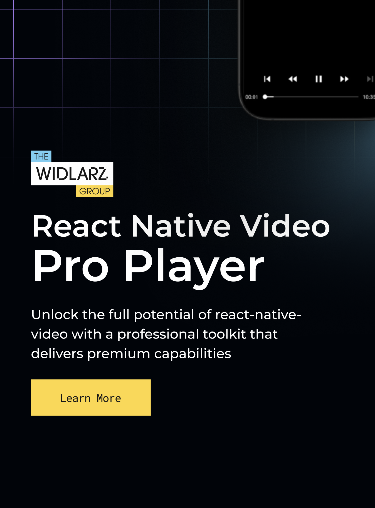

[](https://thewidlarzgroup.com/?utm_source=rnv&utm_medium=readme&utm_id=banner)

The most battle-tested open-source video player component for React Native with support for DRM, offline playback, HLS/DASH streaming, and more.

> [!IMPORTANT]
> This is a new version (v7) of `react-native-video` that is currently in active development.
> You can expect breaking changes and missing features.
> 
> If you have any questions, please contact us at [hi@thewidlarzgroup.com](mailto:hi@thewidlarzgroup.com).

## 🔍 Features

| Feature | Status |
|---------|--------|
| 📱 Plays all video formats natively supported by iOS/Android | ✅ Available |
| ▶️ Local and remote playback | ✅ Available |
| 🔁 Streaming: HLS • DASH • SmoothStreaming | ✅ Available |
| 🧩 Expo plugin support | ✅ Available |
| 📴 Offline playback, video download, support for side-tracks and side-captions (via [optional SDK](https://docs.thewidlarzgroup.com/offline-video-sdk?utm_source=rnv&utm_medium=readme&utm_id=features-text)) | ✅ Available |
| 📱 Picture in Picture | ✅ Available |
| 🎚️ Fine-grained control over tracks, buffering & events | 🏗️ In Development |
| 🧠 Advanced control over playback and buffering | ✅ Available |
| 🔐 DRM: Widevine & FairPlay ([See free DRM stream example](https://www.thewidlarzgroup.com/services/free-drm-token-generator-for-video?utm_source=rnv&utm_medium=readme&utm_id=free-drm)) | ✅ Available |
| 🌐 Basic Web Support | 📝 [TODO](https://github.com/TheWidlarzGroup/react-native-video/issues/4605) |
| 📺 TV Support | 📝 [TODO](https://github.com/TheWidlarzGroup/react-native-video/issues/4607) |
| 🥽 VisionOS Support | 📝 [TODO](https://github.com/TheWidlarzGroup/react-native-video/issues/4608) |


## ✨ Project Status

| Version | State | Architecture |
|---------|-------|--------------|
| **v5 and lower** | ❌ End-of-life [Commercial Support Available](https://www.thewidlarzgroup.com/blog/react-native-video-upgrade-challenges-custom-maintenance-support#how-we-can-help?utm_source=rnv&utm_medium=readme&utm_id=upgradev5) | Old Architecture |
| **v6** | 🛠 Maintained (community + TWG) | Old + New (Interop Layer) |
| **v7** | 🚀 Active Development | Old + New (Full Support) |

`react-native-video` v7 introduces full support for the new React Native architecture, unlocking better performance, improved consistency, and modern native modules.

---

## 📚 Documentation & Examples

- 📖 [Documentation](https://docs.thewidlarzgroup.com/react-native-video/docs/v7/intro)
- 📦 [Example: Basic Usage](https://github.com/TheWidlarzGroup/react-native-video/tree/v7/example)
- 📦 [Example: Free DRM Stream](https://www.thewidlarzgroup.com/services/free-drm-token-generator-for-video?utm_source=rnv&utm_medium=readme&utm_id=free-drm)

## 🚀 Quick Start

### Requirements

- React Native 0.75 or higher
- `react-native-nitro-modules` (>=0.31.10) - Please see [nitro requirements](https://nitro.margelo.com/docs/minimum-requirements)

### Install

`react-native-video` requires `react-native-nitro-modules` (>=0.31.10) in your project.
```bash
npm install react-native-nitro-modules
```

Then install `react-native-video`

```bash
# Install the beta version of react-native-video v7
npm install react-native-video@beta

# Install pods
cd ios && pod install
```

<details>
<summary>For react-native < 0.80</summary>
`react-native` < 0.80 have bug that prevents to properly handle errors by nitro modules on Android.
We highly recommend to apply bellow patch for `react-native-nitro-modules` to fix this issue.
You can apply it using `patch-package`.

Without this patch you won't be able "recognize" errors, all will be thrown as unknown errors.

see [installation guide](https://docs.thewidlarzgroup.com/react-native-video/docs/v7/installation#patch-for-react-native--080)
</details>

### Usage
```tsx
import { useVideoPlayer, VideoView } from 'react-native-video';

export default () => (
  const player = useVideoPlayer(
    'https://www.w3schools.com/html/mov_bbb.mp4',
    (_player) => {
      _player.play();
    }
  );

  <VideoView
    player={player}
    style={{ width: '100%', aspectRatio: 16 / 9 }}
    controls
  />
);
```

---
<a href="https://www.thewidlarzgroup.com/offline-video-sdk?utm_source=rnv&utm_medium=readme&utm_id=banner">
  
</a>

## :inbox_tray: We're building a Pro Player!
We see the need for a more feature-rich video player. There is a gap between open source and commercial players, and we want to fill that gap with plugins.

**Are you using a commercial player just for 1-2 features?** Maybe you are paying for a license just to get **DRM**, **Ads**, or **Analytics**? Let us know. We want to identify these missing pieces and build them, so you can switch back to open source.

**This is what we have already. Check out!**

* [Offline Manager](https://sdk.thewidlarzgroup.com/offline-video): Logic for downloading and watching videos offline.
* [Background Uploader](https://sdk.thewidlarzgroup.com/background-uploader): Handles uploads even if the app is minimized (not strictly a player plugin, but super useful).
* [Chapters](https://sdk.thewidlarzgroup.com/chapters): Visual markers on the timeline to navigate content.

[-> Tell us what to build next ←](https://sdk.thewidlarzgroup.com/ask-for-plugin) or reach out to us sdk@thewidlarzgroup.com

---

## 💼 TWG Services & Products

| Offering | Description |
|----------|-------------|
| [**Professional Support Packages**](https://www.thewidlarzgroup.com/issue-boost?utm_source=rnv&utm_medium=readme&utm_campaign=professional-support-packages#Contact) | Priority bug-fixes, guaranteed SLAs, [roadmap influence](https://github.com/orgs/TheWidlarzGroup/projects/6) |
| [**Issue Booster**](https://www.thewidlarzgroup.com/issue-boost?utm_source=rnv&utm_medium=readme) | Fast-track urgent fixes with a pay‑per‑issue model |
| [**Offline Video SDK**](https://www.thewidlarzgroup.com/offline-video-sdk/?utm_source=rnv&utm_medium=readme&utm_campaign=downloading&utm_id=offline-video-sdk-link) | Plug‑and‑play secure download solution for iOS & Android |
| [**Integration Support**](https://www.thewidlarzgroup.com/?utm_source=rnv&utm_medium=readme&utm_campaign=integration-support#Contact) | Hands‑on help integrating video, DRM & offline into your app |
| [**Free DRM Token Generator**](https://www.thewidlarzgroup.com/services/free-drm-token-generator-for-video?utm_source=rnv&utm_medium=readme&utm_id=free-drm) | Generate Widevine / FairPlay tokens for testing |
| [**Ready Boilerplates**](https://www.thewidlarzgroup.com/showcases?utm_source=rnv&utm_medium=readme) | Ready-to-use apps with offline HLS/DASH DRM, video frame scrubbing, TikTok-style video feed, background uploads, Skia-based frame processor (R&D phase), and more |
| [**React Native Video Upgrade Guide**](https://www.thewidlarzgroup.com/blog/react-native-video-upgrade-challenges-custom-maintenance-support?utm_source=rnv&utm_medium=readme&utm_id=upgrade-blog&utm_campaign=v7) | Common upgrade pitfalls & how to solve them |

*See how [TWG](https://www.thewidlarzgroup.com/?utm_source=rnv&utm_medium=readme&utm_id=services-text) helped **Learnn** ship a world‑class player in record time -  [case study](https://gitnation.com/contents/a-4-year-retrospective-lessons-learned-from-building-a-video-player-from-scratch-with-react-native).*

Contact us at [hi@thewidlarzgroup.com](mailto:hi@thewidlarzgroup.com)

## 🌍 Social

- 🐦 **X / Twitter** - [follow product & release updates](https://x.com/TheWidlarzGroup)
- 💬 **Discord** - [talk to the community and us](https://discord.gg/9WPq6Yx)
- 💼 **LinkedIn** - [see TWG flexing](https://linkedin.com/company/the-widlarz-group)

## 📰 Community & Media

- 🗽 **React Summit US** – How TWG helped Learnn boost video performance on React Native.  
[Watch the talk »](https://gitnation.com/contents/a-4-year-retrospective-lessons-learned-from-building-a-video-player-from-scratch-with-react-native)

- 🧨 **v7 deep dive** – Why we’re building v7 with Nitro Modules
[Watch on X »](https://x.com/krzysztof_moch/status/1854162551946478051)

- 🛠️ **Well-maintained open-source library** - What does it truly mean? - Bart's talk for React Native Warsaw
[Watch here »](https://www.youtube.com/watch?v=RAQQwGCQNqY)

- 📺 **“Over the Top” Panel** - Building Streaming Apps for Mobile, Web, and Smart TVs - Bart giving his insights on the industry
[Watch here »](https://youtu.be/j2b_bG-32JI)
