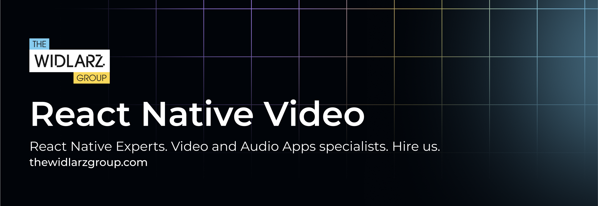
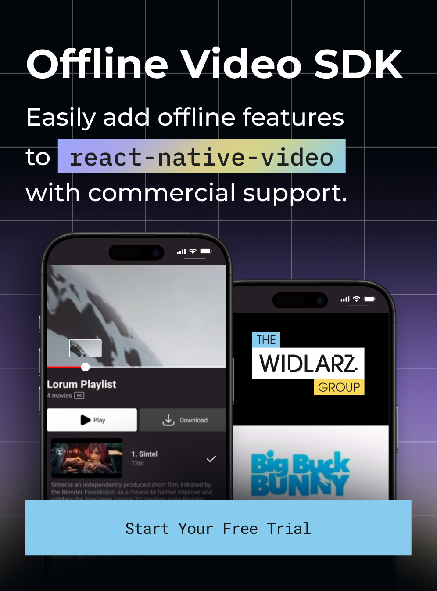
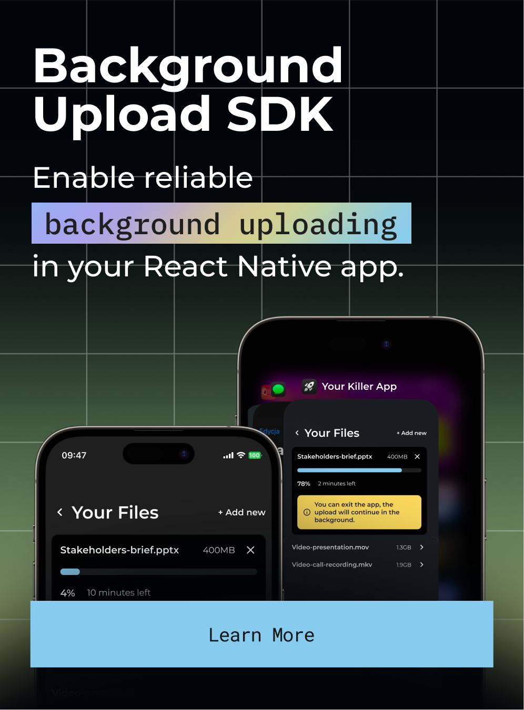

[](https://thewidlarzgroup.com/?utm_source=rnv&utm_medium=readme&utm_id=banner)

The most battle-tested open-source video player component for React Native with support for DRM, offline playback, HLS/DASH streaming, and more.


## 🔍 Features

- 📱 Plays all video formats natively supported by iOS/Android 
- ▶️ Local and remote playback  
- 🔁 Streaming: HLS • DASH • SmoothStreaming  
- 🔐 DRM: Widevine & FairPlay ([See free DRM stream example](https://www.thewidlarzgroup.com/services/free-drm-token-generator-for-video?utm_source=rnv&utm_medium=readme&utm_id=free-drm))
- 📴 Offline playback, video download, support for side-tracks and side-captions (via [optional SDK](https://docs.thewidlarzgroup.com/offline-video-sdk?utm_source=rnv&utm_medium=readme&utm_id=features-text))  
- 🎚️ Fine-grained control over tracks, buffering & events
- 🧩 Expo plugin support
- 🌐 Basic Web Support 
- 📱 Picture in Picture
- 📺 TV Support


## ✨ Project Status

| Version | State | Architecture |
|---------|-------|--------------|
| **v5 and lower** | ❌ End-of-life [Commercial Support Available](https://www.thewidlarzgroup.com/blog/react-native-video-upgrade-challenges-custom-maintenance-support#how-we-can-help?utm_source=rnv&utm_medium=readme&utm_id=upgradev5) | Old Architecture |
| **v6** | 🛠 Maintained (community + TWG) | Old + New (Interop Layer) |
| [**v7**](https://github.com/TheWidlarzGroup/react-native-video/tree/v7) | [🚀 Active Development](https://github.com/TheWidlarzGroup/react-native-video/tree/v7) | Old + New (Full Support) |

[`react-native-video` v7](https://github.com/TheWidlarzGroup/react-native-video/tree/v7) introduces full support for the new React Native architecture, unlocking better performance, improved consistency, and modern native modules.

---

## 📚 Documentation & Examples

- 📖 [Documentation](https://docs.thewidlarzgroup.com/react-native-video/)
- 📦 [Example: Free DRM Stream](https://www.thewidlarzgroup.com/services/free-drm-token-generator-for-video?utm_source=rnv&utm_medium=readme&utm_id=free-drm)
- 📦 [Example: Offline SDK integration](https://docs.thewidlarzgroup.com/offline-video-sdk)

## 🚀 Quick Start

### Install
```bash
# Install dependencies
yarn add react-native-video

# Install pods
cd ios && pod install
```

### Usage
```tsx
import Video from 'react-native-video';

export default () => (
  <Video
    source={{ uri: 'https://www.w3schools.com/html/mov_bbb.mp4' }}
    style={{ width: '100%', aspectRatio: 16 / 9 }}
    controls
  />
);
```

---

## 🧩 Plugins

<a href="https://sdk.thewidlarzgroup.com/offline-video?utm_source=rnv&utm_medium=readme&utm_id=banner">
  
</a>

### 1 · 📥 Offline SDK

#### Need Offline Video Playback in React Native?

If you're building a video-first app and need to **download HLS streams for offline playback**, you're in the right place.

#### 👉 [Check Offline Video SDK for React Native](https://sdk.thewidlarzgroup.com/offline-video?utm_source=rnv&utm_medium=readme&utm_id=check-offline-video-sdk)

This SDK supports:
- 🎞 Offline HLS playback
- 🎧 Multi-language audio track downloads
- 💬 Subtitles support
- 🔐 DRM license handling
- 📊 Analytics & state tracking

---

#### 🔑 How to get access?

- Get a **free trial** (no credit card required)
- Use our [starter project](https://github.com/TheWidlarzGroup/react-native-offline-video-starter) to see it in action
- Integrates with both `v6` and `v7` versions

👉 **[Start Free Trial on the SDK Platform →](https://sdk.thewidlarzgroup.com/signup?utm_source=rnv&utm_medium=readme&utm_id=start-trial-offline-video-sdk)**

---
<a href="https://sdk.thewidlarzgroup.com/background-uploader?utm_source=rnv&utm_medium=readme&utm_id=banner">
  
</a>

### 2 · ⚡ Background Upload SDK

#### Need Reliable Video Uploads in React Native?

If you're building a video-first app and need to **upload large video files reliably in the background**, you're in the right place.

#### 👉 [Check Background Upload SDK for React Native](https://sdk.thewidlarzgroup.com/background-uploader?utm_source=rnv&utm_medium=readme&utm_id=check-background-upload-sdk)

This SDK supports:
- 📤 Background video uploads
- 🔄 Automatic retry mechanisms
- 📊 Upload progress tracking
- 🛡️ Resume interrupted uploads
- 📱 Works when app is backgrounded
- 🔐 Secure upload handling

---

#### 🚀 Perfect for Apps Uploading Large Media

Whether you're building social media apps, content platforms, or enterprise solutions, our Background Upload SDK ensures your users can upload videos seamlessly without interruption.

#### 📞 Ready to Get Started?

Contact us to learn more about integrating background video uploads into your React Native application.

👉 **Contact us at [hi@thewidlarzgroup.com](mailto:hi@thewidlarzgroup.com)**

---

### 3 · 🧪 Architecture

Write your own plugins to extend library logic, attach analytics or add custom workflows - **without forking** the core SDK.  
→ [Plugin documentation](https://docs.thewidlarzgroup.com/react-native-video/docs/v6/other/plugin?utm_source=rnv&utm_medium=readme&utm_id=plugin-text)

---

## 💼 TWG Services & Products

| Offering | Description |
|----------|-------------|
| [**Professional Support Packages**](https://www.thewidlarzgroup.com/issue-boost?utm_source=rnv&utm_medium=readme&utm_campaign=professional-support-packages#Contact) | Priority bug-fixes, guaranteed SLAs, [roadmap influence](https://github.com/orgs/TheWidlarzGroup/projects/6) |
| [**Issue Booster**](https://www.thewidlarzgroup.com/issue-boost?utm_source=rnv&utm_medium=readme) | Fast-track urgent fixes with a pay‑per‑issue model |
| [**Offline Video SDK**](https://sdk.thewidlarzgroup.com/offline-video?utm_source=rnv&utm_medium=readme&utm_campaign=downloading&utm_id=offline-video-sdk-link) | Plug‑and‑play secure download solution for iOS & Android |
| [**Background Upload SDK**](https://sdk.thewidlarzgroup.com/background-uploader?utm_source=rnv&utm_medium=readme&utm_campaign=uploading&utm_id=background-upload-sdk-link) | Reliable background upload solution for iOS & Android |
| [**Integration Support**](https://www.thewidlarzgroup.com/?utm_source=rnv&utm_medium=readme&utm_campaign=integration-support#Contact) | Hands‑on help integrating video, DRM & offline into your app |
| [**Free DRM Token Generator**](https://www.thewidlarzgroup.com/services/free-drm-token-generator-for-video?utm_source=rnv&utm_medium=readme&utm_id=free-drm) | Generate Widevine / FairPlay tokens for testing |
| [**Ready Boilerplates**](https://www.thewidlarzgroup.com/showcases?utm_source=rnv&utm_medium=readme) | Ready-to-use apps with offline HLS/DASH DRM, video frame scrubbing, TikTok-style video feed, background uploads, Skia-based frame processor (R&D phase), and more |
| [**React Native Video Upgrade Guide**](https://www.thewidlarzgroup.com/blog/react-native-video-upgrade-challenges-custom-maintenance-support?utm_source=rnv&utm_medium=readme&utm_id=upgrade-blog&utm_campaign=v7) | Common upgrade pitfalls & how to solve them |

*See how [TWG](https://www.thewidlarzgroup.com/?utm_source=rnv&utm_medium=readme&utm_id=services-text) helped **Learnn** ship a world‑class player in record time -  [case study](https://gitnation.com/contents/a-4-year-retrospective-lessons-learned-from-building-a-video-player-from-scratch-with-react-native).*

Contact us at [hi@thewidlarzgroup.com](mailto:hi@thewidlarzgroup.com)

## 🌍 Social

- 🐦 **X / Twitter** - [follow product & release updates](https://x.com/TheWidlarzGroup)
- 💬 **Discord** - [talk to the community and us](https://discord.gg/9WPq6Yx)
- 💼 **LinkedIn** - [see TWG flexing](https://linkedin.com/company/the-widlarz-group)

## 📰 Community & Media

- 🗽 **React Summit US** – How TWG helped Learnn boost video performance on React Native.  
[Watch the talk »](https://gitnation.com/contents/a-4-year-retrospective-lessons-learned-from-building-a-video-player-from-scratch-with-react-native)

- 🧨 **v7 deep dive** – Why we’re building v7 with Nitro Modules
[Watch on X »](https://x.com/krzysztof_moch/status/1854162551946478051)

- 🛠️ **Well-maintained open-source library** - What does it truly mean? - Bart's talk for React Native Warsaw
[Watch here »](https://www.youtube.com/watch?v=RAQQwGCQNqY)

- 📺 **“Over the Top” Panel** - Building Streaming Apps for Mobile, Web, and Smart TVs - Bart giving his insights on the industry
[Watch here »](https://youtu.be/j2b_bG-32JI)
