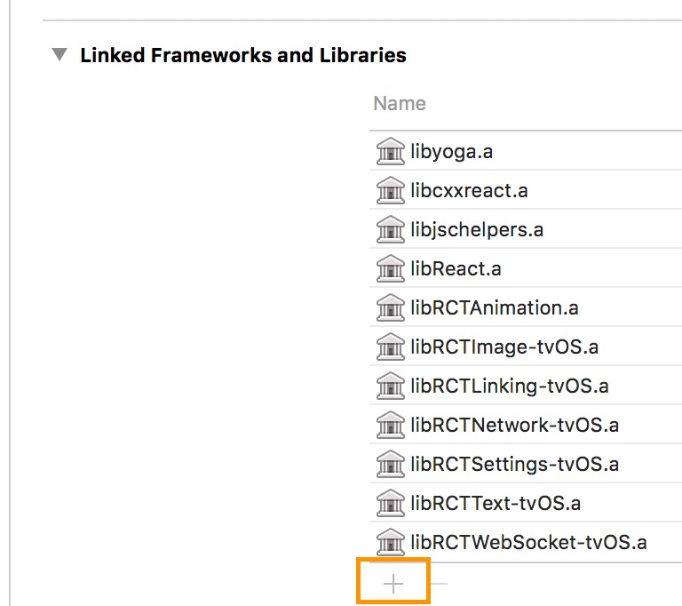

## react-native-video

A `<Video>` component for react-native, as seen in
[react-native-login](https://github.com/brentvatne/react-native-login)!

Version 4.x requires react-native >= 0.57.0

Version 3.x requires react-native >= 0.40.0

### Version 4.0.0 breaking changes
Version 4.0.0 changes some behaviors and may require updates to your Gradle files.  See [Updating](#updating) for details.

Version 4.0.0 now requires Android target SDK 26+ and Gradle 3 plugin in order to support ExoPlayer 2.9.0. Google is dropping support for apps using target SDKs older than 26 as of October 2018 and Gradle 2 as of January 2019. React Native 0.57 defaults to Gradle 3 & SDK 27.

If you need to support an older React Native version, you should use react-native-video 3.2.1.

### Version 3.0.0 breaking changes
Version 3.0 features a number of changes to existing behavior. See [Updating](#updating) for changes.

## Table of Contents

* [Installation](#installation)
* [Usage](#usage)
* [iOS App Transport Security](#ios-app-transport-security)
* [Audio Mixing](#audio-mixing)
* [Android Expansion File Usage](#android-expansion-file-usage)
* [Updating](#updating)

## Installation

Using npm:

```shell
npm install --save react-native-video
```

or using yarn:

```shell
yarn add react-native-video
```

Then follow the instructions for your platform to link react-native-video into your project:

<details>
  <summary>iOS</summary>

### Standard Method

Run `react-native link react-native-video` to link the react-native-video library.

### Using CocoaPods (required to enable caching)

Setup your Podfile like it is described in the [react-native documentation](https://facebook.github.io/react-native/docs/integration-with-existing-apps#configuring-cocoapods-dependencies). 

Depending on your requirements you have to choose between the two possible subpodspecs:

Video only:

```diff
  pod 'Folly', :podspec => '../node_modules/react-native/third-party-podspecs/Folly.podspec'
+  `pod 'react-native-video', :path => '../node_modules/react-native-video/react-native-video.podspec'`
end
```

Video with caching ([more info](docs/caching.md)):

```diff
  pod 'Folly', :podspec => '../node_modules/react-native/third-party-podspecs/Folly.podspec'
+  `pod 'react-native-video/VideoCaching', :path => '../node_modules/react-native-video/react-native-video.podspec'`
end
```

</details>

<details>
  <summary>tvOS</summary>
  
`react-native link react-native-video` doesn’t work properly with the tvOS target so we need to add the library manually.

First select your project in Xcode.


After that, select the tvOS target of your application and select « General » tab


Scroll to « Linked Frameworks and Libraries » and tap on the + button



Select RCTVideo-tvOS


</details>

<details>
  <summary>Android</summary>

Run `react-native link react-native-video` to link the react-native-video library.

Or if you have trouble, make the following additions to the given files manually:

**android/settings.gradle**

The newer ExoPlayer library will work for most people.

```gradle
include ':react-native-video'
project(':react-native-video').projectDir = new File(rootProject.projectDir, '../node_modules/react-native-video/android-exoplayer')
```

If you need to use the old Android MediaPlayer based player, use the following instead:

```gradle
include ':react-native-video'
project(':react-native-video').projectDir = new File(rootProject.projectDir, '../node_modules/react-native-video/android')
```


**android/app/build.gradle**

```gradle
dependencies {
   ...
   compile project(':react-native-video')
}
```

**MainApplication.java**

On top, where imports are:

```java
import com.brentvatne.react.ReactVideoPackage;
```

Add the `ReactVideoPackage` class to your list of exported packages.

```java
@Override
protected List<ReactPackage> getPackages() {
    return Arrays.asList(
            new MainReactPackage(),
            new ReactVideoPackage()
    );
}
```
</details>

<details>
  <summary>Windows</summary>

Make the following additions to the given files manually:

**windows/myapp.sln**

Add the `ReactNativeVideo` project to your solution.

1. Open the solution in Visual Studio 2015
2. Right-click Solution icon in Solution Explorer > Add > Existing Project
  * UWP: Select `node_modules\react-native-video\windows\ReactNativeVideo\ReactNativeVideo.csproj`
  * WPF: Select `node_modules\react-native-video\windows\ReactNativeVideo.Net46\ReactNativeVideo.Net46.csproj`

**windows/myapp/myapp.csproj**

Add a reference to `ReactNativeVideo` to your main application project. From Visual Studio 2015:

1. Right-click main application project > Add > Reference...
  * UWP: Check `ReactNativeVideo` from Solution Projects.
  * WPF: Check `ReactNativeVideo.Net46` from Solution Projects.

**MainPage.cs**

Add the `ReactVideoPackage` class to your list of exported packages.
```cs
using ReactNative;
using ReactNative.Modules.Core;
using ReactNative.Shell;
using ReactNativeVideo; // <-- Add this
using System.Collections.Generic;
...

        public override List<IReactPackage> Packages
        {
            get
            {
                return new List<IReactPackage>
                {
                    new MainReactPackage(),
                    new ReactVideoPackage(), // <-- Add this
                };
            }
        }

...
```
</details>

<details>
  <summary>react-native-dom</summary>

Make the following additions to the given files manually:

**dom/bootstrap.js**

Import RCTVideoManager and add it to the list of nativeModules:

```javascript
import { RNDomInstance } from "react-native-dom";
import { name as appName } from "../app.json";
import RCTVideoManager from 'react-native-video/dom/RCTVideoManager'; // Add this

// Path to RN Bundle Entrypoint ================================================
const rnBundlePath = "./entry.bundle?platform=dom&dev=true";

// React Native DOM Runtime Options =============================================
const ReactNativeDomOptions = {
  enableHotReload: false,
  nativeModules: [RCTVideoManager] // Add this
};
```
</details>

## Usage

```javascript
// Load the module

import Video from 'react-native-video';

// Within your render function, assuming you have a file called
// "background.mp4" in your project. You can include multiple videos
// on a single screen if you like.

<Video source={{uri: "background"}}   // Can be a URL or a local file.
       ref={(ref) => {
         this.player = ref
       }}                                      // Store reference
       onBuffer={this.onBuffer}                // Callback when remote video is buffering
       onError={this.videoError}               // Callback when video cannot be loaded
       style={styles.backgroundVideo} />

// Later on in your styles..
var styles = StyleSheet.create({
  backgroundVideo: {
    position: 'absolute',
    top: 0,
    left: 0,
    bottom: 0,
    right: 0,
  },
});
```

### Configurable props
* [allowsExternalPlayback](#allowsexternalplayback)
* [audioOnly](#audioonly)
* [bufferConfig](#bufferconfig)
* [controls](#controls)
* [filter](#filter)
* [filterEnabled](#filterEnabled)
* [fullscreen](#fullscreen)
* [fullscreenAutorotate](#fullscreenautorotate)
* [fullscreenOrientation](#fullscreenorientation)
* [headers](#headers)
* [hideShutterView](#hideshutterview)
* [id](#id)
* [ignoreSilentSwitch](#ignoresilentswitch)
* [maxBitRate](#maxbitrate)
* [minLoadRetryCount](#minLoadRetryCount)
* [muted](#muted)
* [paused](#paused)
* [pictureInPicture](#pictureinpicture)
* [playInBackground](#playinbackground)
* [playWhenInactive](#playwheninactive)
* [poster](#poster)
* [posterResizeMode](#posterresizemode)
* [progressUpdateInterval](#progressupdateinterval)
* [rate](#rate)
* [repeat](#repeat)
* [reportBandwidth](#reportbandwidth)
* [resizeMode](#resizemode)
* [selectedAudioTrack](#selectedaudiotrack)
* [selectedTextTrack](#selectedtexttrack)
* [selectedVideoTrack](#selectedvideotrack)
* [source](#source)
* [stereoPan](#stereopan)
* [textTracks](#texttracks)
* [useTextureView](#usetextureview)
* [volume](#volume)

### Event props
* [onAudioBecomingNoisy](#onaudiobecomingnoisy)
* [onBandwidthUpdate](#onbandwidthupdate)
* [onEnd](#onend)
* [onExternalPlaybackChange](#onexternalplaybackchange)
* [onFullscreenPlayerWillPresent](#onfullscreenplayerwillpresent)
* [onFullscreenPlayerDidPresent](#onfullscreenplayerdidpresent)
* [onFullscreenPlayerWillDismiss](#onfullscreenplayerwilldismiss)
* [onFullscreenPlayerDidDismiss](#onfullscreenplayerdiddismiss)
* [onLoad](#onload)
* [onLoadStart](#onloadstart)
* [onReadyForDisplay](#onreadyfordisplay)
* [onPictureInPictureStatusChanged](#onpictureinpicturestatuschanged)
* [onPlaybackRateChange](#onplaybackratechange)
* [onProgress](#onprogress)
* [onSeek](#onseek)
* [onRestoreUserInterfaceForPictureInPictureStop](#onrestoreuserinterfaceforpictureinpicturestop)
* [onTimedMetadata](#ontimedmetadata)

### Methods
* [dismissFullscreenPlayer](#dismissfullscreenplayer)
* [presentFullscreenPlayer](#presentfullscreenplayer)
* [save](#save)
* [restoreUserInterfaceForPictureInPictureStop](#restoreuserinterfaceforpictureinpicturestop)
* [seek](#seek)

### Configurable props

#### allowsExternalPlayback
Indicates whether the player allows switching to external playback mode such as AirPlay or HDMI.
* **true (default)** - allow switching to external playback mode
* **false** -  Don't allow switching to external playback mode

Platforms: iOS

#### audioOnly
Indicates whether the player should only play the audio track and instead of displaying the video track, show the poster instead.
* **false (default)** - Display the video as normal
* **true** - Show the poster and play the audio

For this to work, the poster prop must be set.

Platforms: all

#### bufferConfig
Adjust the buffer settings. This prop takes an object with one or more of the properties listed below.

Property | Type | Description
--- | --- | ---
minBufferMs | number | The default minimum duration of media that the player will attempt to ensure is buffered at all times, in milliseconds.
maxBufferMs | number | The default maximum duration of media that the player will attempt to buffer, in milliseconds.
bufferForPlaybackMs | number | The default duration of media that must be buffered for playback to start or resume following a user action such as a seek, in milliseconds.
playbackAfterRebufferMs | number | The default duration of media that must be buffered for playback to resume after a rebuffer, in milliseconds. A rebuffer is defined to be caused by buffer depletion rather than a user action.

This prop should only be set when you are setting the source, changing it after the media is loaded will cause it to be reloaded.

Example with default values:
```
bufferConfig={{
  minBufferMs: 15000,
  maxBufferMs: 50000,
  bufferForPlaybackMs: 2500,
  bufferForPlaybackAfterRebufferMs: 5000
}}
```

Platforms: Android ExoPlayer

#### controls
Determines whether to show player controls.
* ** false (default)** - Don't show player controls
* **true** - Show player controls

Note on iOS, controls are always shown when in fullscreen mode.

For Android MediaPlayer, you will need to build your own controls or use a package like [react-native-video-controls](https://github.com/itsnubix/react-native-video-controls) or [react-native-video-player](https://github.com/cornedor/react-native-video-player).

Platforms: Android ExoPlayer, iOS, react-native-dom

#### filter
Add video filter
* **FilterType.NONE (default)** - No Filter
* **FilterType.INVERT** - CIColorInvert
* **FilterType.MONOCHROME** - CIColorMonochrome
* **FilterType.POSTERIZE** - CIColorPosterize
* **FilterType.FALSE** - CIFalseColor
* **FilterType.MAXIMUMCOMPONENT** - CIMaximumComponent
* **FilterType.MINIMUMCOMPONENT** - CIMinimumComponent
* **FilterType.CHROME** - CIPhotoEffectChrome
* **FilterType.FADE** - CIPhotoEffectFade
* **FilterType.INSTANT** - CIPhotoEffectInstant
* **FilterType.MONO** - CIPhotoEffectMono
* **FilterType.NOIR** - CIPhotoEffectNoir
* **FilterType.PROCESS** - CIPhotoEffectProcess
* **FilterType.TONAL** - CIPhotoEffectTonal
* **FilterType.TRANSFER** - CIPhotoEffectTransfer
* **FilterType.SEPIA** - CISepiaTone

For more details on these filters refer to the [iOS docs](https://developer.apple.com/library/archive/documentation/GraphicsImaging/Reference/CoreImageFilterReference/index.html#//apple_ref/doc/uid/TP30000136-SW55).

Notes: 
1. Using a filter can impact CPU usage. A workaround is to save the video with the filter and then load the saved video.
2. Video filter is currently not supported on HLS playlists.
3. `filterEnabled` must be set to `true`

Platforms: iOS

#### filterEnabled
Enable video filter. 

* **false (default)** - Don't enable filter
* **true** - Enable filter

Platforms: iOS

#### fullscreen
Controls whether the player enters fullscreen on play.
* **false (default)** - Don't display the video in fullscreen
* **true** - Display the video in fullscreen

Platforms: iOS

#### fullscreenAutorotate
If a preferred [fullscreenOrientation](#fullscreenorientation) is set, causes the video to rotate to that orientation but permits rotation of the screen to orientation held by user. Defaults to TRUE.

Platforms: iOS

#### fullscreenOrientation

* **all (default)** - 
* **landscape**
* **portrait**

Platforms: iOS

#### headers
Pass headers to the HTTP client. Can be used for authorization. Headers must be a part of the source object.

To enable this on iOS, you will need to manually edit RCTVideo.m and uncomment the header code in the playerItemForSource function. This is because the code used a private API and may cause your app to be rejected by the App Store. Use at your own risk.

Example:
```
source={{
  uri: "https://www.example.com/video.mp4",
  headers: {
    Authorization: 'bearer some-token-value',
    'X-Custom-Header': 'some value'
  }
}}
```

Platforms: Android ExoPlayer

#### hideShutterView
Controls whether the ExoPlayer shutter view (black screen while loading) is enabled.

* **false (default)** - Show shutter view 
* **true** - Hide shutter view

Platforms: Android ExoPlayer

#### id
Set the DOM id element so you can use document.getElementById on web platforms. Accepts string values.

Example:
```
id="video"
```

Platforms: react-native-dom

#### ignoreSilentSwitch
Controls the iOS silent switch behavior
* **"inherit" (default)** - Use the default AVPlayer behavior
* **"ignore"** - Play audio even if the silent switch is set
* **"obey"** - Don't play audio if the silent switch is set

Platforms: iOS

#### maxBitRate
Sets the desired limit, in bits per second, of network bandwidth consumption when multiple video streams are available for a playlist.

Default: 0. Don't limit the maxBitRate.

Example:
```
maxBitRate={2000000} // 2 megabits
```

Platforms: Android ExoPlayer, iOS

#### minLoadRetryCount
Sets the minimum number of times to retry loading data before failing and reporting an error to the application. Useful to recover from transient internet failures.

Default: 3. Retry 3 times.

Example:
```
minLoadRetryCount={5} // retry 5 times
```

Platforms: Android ExoPlayer

#### muted
Controls whether the audio is muted
* **false (default)** - Don't mute audio
* **true** - Mute audio

Platforms: all

#### paused
Controls whether the media is paused
* **false (default)** - Don't pause the media
* **true** - Pause the media

Platforms: all

#### pictureInPicture
Determine whether the media should played as picture in picture.
* **false (default)** - Don't not play as picture in picture
* **true** - Play the media as picture in picture

Platforms: iOS

#### playInBackground
Determine whether the media should continue playing while the app is in the background. This allows customers to continue listening to the audio.
* **false (default)** - Don't continue playing the media
* **true** - Continue playing the media

To use this feature on iOS, you must:
* [Enable Background Audio](https://developer.apple.com/library/archive/documentation/Audio/Conceptual/AudioSessionProgrammingGuide/AudioSessionBasics/AudioSessionBasics.html#//apple_ref/doc/uid/TP40007875-CH3-SW3) in your Xcode project
* Set the ignoreSilentSwitch prop to "ignore"

Platforms: Android ExoPlayer, Android MediaPlayer, iOS

#### playWhenInactive
Determine whether the media should continue playing when notifications or the Control Center are in front of the video.
* **false (default)** - Don't continue playing the media
* **true** - Continue playing the media

Platforms: iOS

#### poster
An image to display while the video is loading
<br>Value: string with a URL for the poster, e.g. "https://baconmockup.com/300/200/"

Platforms: all

#### posterResizeMode
Determines how to resize the poster image when the frame doesn't match the raw video dimensions.
* **"contain" (default)** - Scale the image uniformly (maintain the image's aspect ratio) so that both dimensions (width and height) of the image will be equal to or less than the corresponding dimension of the view (minus padding).
* **"center"** - Center the image in the view along both dimensions. If the image is larger than the view, scale it down uniformly so that it is contained in the view.
* **"cover"** - Scale the image uniformly (maintain the image's aspect ratio) so that both dimensions (width and height) of the image will be equal to or larger than the corresponding dimension of the view (minus padding).
* **"none"** - Don't apply resize
* **"repeat"** - Repeat the image to cover the frame of the view. The image will keep its size and aspect ratio. (iOS only)
* **"stretch"** - Scale width and height independently, This may change the aspect ratio of the src.

Platforms: all

#### progressUpdateInterval
Delay in milliseconds between onProgress events in milliseconds.

Default: 250.0

Platforms: all

### rate
Speed at which the media should play. 
* **0.0** - Pauses the video
* **1.0** - Play at normal speed
* **Other values** - Slow down or speed up playback

Platforms: all

Note: For Android MediaPlayer, rate is only supported on Android 6.0 and higher devices.

#### repeat
Determine whether to repeat the video when the end is reached
* **false (default)** - Don't repeat the video
* **true** - Repeat the video

Platforms: all

#### reportBandwidth
Determine whether to generate onBandwidthUpdate events. This is needed due to the high frequency of these events on ExoPlayer.

* **false (default)** - Generate onBandwidthUpdate events
* **true** - Don't generate onBandwidthUpdate events

Platforms: Android ExoPlayer

#### resizeMode
Determines how to resize the video when the frame doesn't match the raw video dimensions.
* **"none" (default)** - Don't apply resize
* **"contain"** - Scale the video uniformly (maintain the video's aspect ratio) so that both dimensions (width and height) of the video will be equal to or less than the corresponding dimension of the view (minus padding).
* **"cover"** - Scale the video uniformly (maintain the video's aspect ratio) so that both dimensions (width and height) of the image will be equal to or larger than the corresponding dimension of the view (minus padding).
* **"stretch"** - Scale width and height independently, This may change the aspect ratio of the src.

Platforms: Android ExoPlayer, Android MediaPlayer, iOS, Windows UWP

#### selectedAudioTrack
Configure which audio track, if any, is played.

```
selectedAudioTrack={{
  type: Type,
  value: Value
}}
```

Example:
```
selectedAudioTrack={{
  type: "title",
  value: "Dubbing"
}}
```

Type | Value | Description
--- | --- | ---
"system" (default) | N/A | Play the audio track that matches the system language. If none match, play the first track.
"disabled" | N/A | Turn off audio
"title" | string | Play the audio track with the title specified as the Value, e.g. "French"
"language" | string | Play the audio track with the language specified as the Value, e.g. "fr"
"index" | number | Play the audio track with the index specified as the value, e.g. 0

If a track matching the specified Type (and Value if appropriate) is unavailable, the first audio track will be played. If multiple tracks match the criteria, the first match will be used.

Platforms: Android ExoPlayer, iOS

#### selectedTextTrack
Configure which text track (caption or subtitle), if any, is shown.

```
selectedTextTrack={{
  type: Type,
  value: Value
}}
```

Example:
```
selectedTextTrack={{
  type: "title",
  value: "English Subtitles"
}}
```

Type | Value | Description
--- | --- | ---
"system" (default) | N/A | Display captions only if the system preference for captions is enabled
"disabled" | N/A | Don't display a text track
"title" | string | Display the text track with the title specified as the Value, e.g. "French 1"
"language" | string | Display the text track with the language specified as the Value, e.g. "fr"
"index" | number | Display the text track with the index specified as the value, e.g. 0

Both iOS & Android (only 4.4 and higher) offer Settings to enable Captions for hearing impaired people. If "system" is selected and the Captions Setting is enabled, iOS/Android will look for a caption that matches that customer's language and display it. 

If a track matching the specified Type (and Value if appropriate) is unavailable, no text track will be displayed. If multiple tracks match the criteria, the first match will be used.

Platforms: Android ExoPlayer, iOS

#### selectedVideoTrack
Configure which video track should be played. By default, the player uses Adaptive Bitrate Streaming to automatically select the stream it thinks will perform best based on available bandwidth.

```
selectedVideoTrack={{
  type: Type,
  value: Value
}}
```

Example:
```
selectedVideoTrack={{
  type: "resolution",
  value: 480
}}
```

Type | Value | Description
--- | --- | ---
"auto" (default) | N/A | Let the player determine which track to play using ABR
"disabled" | N/A | Turn off video
"resolution" | number | Play the video track with the height specified, e.g. 480 for the 480p stream
"index" | number | Play the video track with the index specified as the value, e.g. 0

If a track matching the specified Type (and Value if appropriate) is unavailable, ABR will be used.

Platforms: Android ExoPlayer

#### source
Sets the media source. You can pass an asset loaded via require or an object with a uri.

The docs for this prop are incomplete and will be updated as each option is investigated and tested.


##### Asset loaded via require

Example: 
```
const sintel = require('./sintel.mp4');

source={sintel}
```

##### URI string

A number of URI schemes are supported by passing an object with a `uri` attribute.

###### Web address (http://, https://)

Example:
```
source={{uri: 'https://www.sample-videos.com/video/mp4/720/big_buck_bunny_720p_10mb.mp4' }}
```

Platforms: all

###### File path (file://)

Example:
```
source={{ uri: 'file:///sdcard/Movies/sintel.mp4' }}
```

Note: Your app will need to request permission to read external storage if you're accessing a file outside your app.

Platforms: Android ExoPlayer, Android MediaPlayer, possibly others

###### iPod Library (ipod-library://)

Path to a sound file in your iTunes library. Typically shared from iTunes to your app.

Example:
```
source={{ uri: 'ipod-library:///path/to/music.mp3' }}
```

Note: Using this feature adding an entry for NSAppleMusicUsageDescription to your Info.plist file as described [here](https://developer.apple.com/library/archive/documentation/General/Reference/InfoPlistKeyReference/Articles/CocoaKeys.html)

Platforms: iOS

###### Other protocols

The following other types are supported on some platforms, but aren't fully documented yet:
`content://, ms-appx://, ms-appdata://, assets-library://`


#### stereoPan
Adjust the balance of the left and right audio channels.  Any value between –1.0 and 1.0 is accepted.
* **-1.0** - Full left
* **0.0 (default)** - Center
* **1.0** - Full right

Platforms: Android MediaPlayer

#### textTracks
Load one or more "sidecar" text tracks. This takes an array of objects representing each track. Each object should have the format:

Property | Description
--- | ---
title | Descriptive name for the track
language | 2 letter [ISO 639-1 code](https://en.wikipedia.org/wiki/List_of_ISO_639-1_codes) representing the language
type | Mime type of the track<br> * TextTrackType.SRT - SubRip (.srt)<br> * TextTrackType.TTML - TTML (.ttml)<br> * TextTrackType.VTT - WebVTT (.vtt)<br>iOS only supports VTT, Android ExoPlayer supports all 3
uri | URL for the text track. Currently, only tracks hosted on a webserver are supported

On iOS, sidecar text tracks are only supported for individual files, not HLS playlists. For HLS, you should include the text tracks as part of the playlist.

Note: Due to iOS limitations, sidecar text tracks are not compatible with Airplay. If textTracks are specified, AirPlay support will be automatically disabled.

Example:
```
import { TextTrackType }, Video from 'react-native-video';

textTracks={[
  {
    title: "English CC",
    language: "en",
    type: TextTrackType.VTT, // "text/vtt"
    uri: "https://bitdash-a.akamaihd.net/content/sintel/subtitles/subtitles_en.vtt"
  },
  {
    title: "Spanish Subtitles",
    language: "es",
    type: TextTrackType.SRT, // "application/x-subrip"
    uri: "https://durian.blender.org/wp-content/content/subtitles/sintel_es.srt"
  }
]}
```


Platforms: Android ExoPlayer, iOS

#### useTextureView
Controls whether to output to a TextureView or SurfaceView.

SurfaceView is more efficient and provides better performance but has two limitations:
* It can't be animated, transformed or scaled
* You can't overlay multiple SurfaceViews

useTextureView can only be set at same time you're setting the source.

* **true (default)** - Use a TextureView
* **false** - Use a SurfaceView

Platforms: Android ExoPlayer

#### volume
Adjust the volume.
* **1.0 (default)** - Play at full volume
* **0.0** - Mute the audio
* **Other values** - Reduce volume

Platforms: all


### Event props

#### onAudioBecomingNoisy
Callback function that is called when the audio is about to become 'noisy' due to a change in audio outputs. Typically this is called when audio output is being switched from an external source like headphones back to the internal speaker. It's a good idea to pause the media when this happens so the speaker doesn't start blasting sound.

Payload: none

Platforms: Android ExoPlayer, iOS

#### onBandwidthUpdate
Callback function that is called when the available bandwidth changes.

Payload:

Property | Type | Description
--- | --- | ---
bitrate | number | The estimated bitrate in bits/sec

Example:
```
{
  bitrate: 1000000
}
```

Note: On Android ExoPlayer, you must set the [reportBandwidth](#reportbandwidth) prop to enable this event. This is due to the high volume of events generated.

Platforms: Android ExoPlayer

#### onEnd
Callback function that is called when the player reaches the end of the media.

Payload: none

Platforms: all

#### onExternalPlaybackChange
Callback function that is called when external playback mode for current playing video has changed. Mostly useful when connecting/disconnecting to Apple TV – it's called on connection/disconnection.

Payload:

Property | Type | Description
--- | --- | ---
isExternalPlaybackActive | boolean | Boolean indicating whether external playback mode is active

Example:
```
{
  isExternalPlaybackActive: true
}
```

Platforms: iOS

#### onFullscreenPlayerWillPresent
Callback function that is called when the player is about to enter fullscreen mode.

Payload: none

Platforms: Android ExoPlayer, Android MediaPlayer, iOS

#### onFullscreenPlayerDidPresent
Callback function that is called when the player has entered fullscreen mode.

Payload: none

Platforms: Android ExoPlayer, Android MediaPlayer, iOS

#### onFullscreenPlayerWillDismiss
Callback function that is called when the player is about to exit fullscreen mode.

Payload: none

Platforms: Android ExoPlayer, Android MediaPlayer, iOS

#### onFullscreenPlayerDidDismiss
Callback function that is called when the player has exited fullscreen mode.

Payload: none

Platforms: Android ExoPlayer, Android MediaPlayer, iOS

#### onLoad
Callback function that is called when the media is loaded and ready to play.

Payload:

Property | Type | Description
--- | --- | ---
currentPosition | number | Time in seconds where the media will start
duration | number | Length of the media in seconds
naturalSize | object | Properties:<br> * width - Width in pixels that the video was encoded at<br> * height - Height in pixels that the video was encoded at<br> * orientation - "portrait" or "landscape"
audioTracks | array | An array of audio track info objects with the following properties:<br> * index - Index number<br> * title - Description of the track<br> * language - 2 letter [ISO 639-1](https://en.wikipedia.org/wiki/List_of_ISO_639-1_codes) or 3 letter [ISO639-2](https://en.wikipedia.org/wiki/List_of_ISO_639-2_codes) language code<br> * type - Mime type of track
textTracks | array | An array of text track info objects with the following properties:<br> * index - Index number<br> * title - Description of the track<br> * language - 2 letter [ISO 639-1](https://en.wikipedia.org/wiki/List_of_ISO_639-1_codes) or 3 letter [ISO 639-2](https://en.wikipedia.org/wiki/List_of_ISO_639-2_codes) language code<br> * type - Mime type of track

Example:
```
{ 
  canPlaySlowForward: true,
  canPlayReverse: false,
  canPlaySlowReverse: false,
  canPlayFastForward: false,
  canStepForward: false,
  canStepBackward: false,
  currentTime: 0,
  duration: 5910.208984375,
  naturalSize: {
     height: 1080
     orientation: 'landscape'
     width: '1920'
  },
  audioTracks: [
    { language: 'es', title: 'Spanish', type: 'audio/mpeg', index: 0 },
    { language: 'en', title: 'English', type: 'audio/mpeg', index: 1 }
  ],
  textTracks: [
    { title: '#1 French', language: 'fr', index: 0, type: 'text/vtt' },
    { title: '#2 English CC', language: 'en', index: 1, type: 'text/vtt' },
    { title: '#3 English Director Commentary', language: 'en', index: 2, type: 'text/vtt' }
  ]
}
```

Platforms: all

#### onLoadStart
Callback function that is called when the media starts loading.

Payload:

Property | Description
--- | ---
isNetwork | boolean | Boolean indicating if the media is being loaded from the network
type | string | Type of the media. Not available on Windows
uri | string | URI for the media source. Not available on Windows

Example:
```
{
  isNetwork: true,
  type: '',
  uri: 'https://bitdash-a.akamaihd.net/content/sintel/hls/playlist.m3u8'
}
```

Platforms: all

#### onReadyForDisplay
Callback function that is called when the first video frame is ready for display. This is when the poster is removed.

Payload: none

* iOS: [readyForDisplay](https://developer.apple.com/documentation/avkit/avplayerviewcontroller/1615830-readyfordisplay?language=objc)
* Android: [MEDIA_INFO_VIDEO_RENDERING_START](https://developer.android.com/reference/android/media/MediaPlayer#MEDIA_INFO_VIDEO_RENDERING_START)
* Android ExoPlayer [STATE_READY](https://exoplayer.dev/doc/reference/com/google/android/exoplayer2/Player.html#STATE_READY)

Platforms: Android ExoPlayer, Android MediaPlayer, iOS, Web

#### onPictureInPictureStatusChanged
Callback function that is called when picture in picture becomes active or inactive.

Property | Type | Description
--- | --- | ---
isActive | boolean | Boolean indicating whether picture in picture is active

Example:
```
{
isActive: true
}
```

Platforms:  iOS

#### onPlaybackRateChange
Callback function that is called when the rate of playback changes - either paused or starts/resumes.

Property | Type | Description
--- | --- | ---
playbackRate | number | 0 when playback is paused, 1 when playing at normal speed. Other values when playback is slowed down or sped up

Example:
```
{
  playbackRate: 0, // indicates paused
}
```

Platforms: all


#### onProgress
Callback function that is called every progressUpdateInterval seconds with info about which position the media is currently playing.

Property | Type | Description
--- | --- | ---
currentTime | number | Current position in seconds
playableDuration | number | Position to where the media can be played to using just the buffer in seconds
seekableDuration | number | Position to where the media can be seeked to in seconds. Typically, the total length of the media

Example:
```
{
  currentTime: 5.2,
  playableDuration: 34.6,
  seekableDuration: 888
}
```

Platforms: all

#### onSeek
Callback function that is called when a seek completes.

Payload:

Property | Type | Description
--- | --- | ---
currentTime | number | The current time after the seek
seekTime | number | The requested time

Example:
```
{
  currentTime: 100.5
  seekTime: 100
}
```

Both the currentTime & seekTime are reported because the video player may not seek to the exact requested position in order to improve seek performance.


Platforms: Android ExoPlayer, Android MediaPlayer, iOS, Windows UWP

#### onRestoreUserInterfaceForPictureInPictureStop
Callback function that corresponds to Apple's [`restoreUserInterfaceForPictureInPictureStopWithCompletionHandler`](https://developer.apple.com/documentation/avkit/avpictureinpicturecontrollerdelegate/1614703-pictureinpicturecontroller?language=objc). Call `restoreUserInterfaceForPictureInPictureStopCompleted` inside of this function when done restoring the user interface. 

Payload: none

Platforms: iOS

#### onTimedMetadata
Callback function that is called when timed metadata becomes available

Payload:

Property | Type | Description
--- | --- | ---
metadata | array | Array of metadata objects

Example:
```
{
  metadata: [
    { value: 'Streaming Encoder', identifier: 'TRSN' },
    { value: 'Internet Stream', identifier: 'TRSO' },
    { value: 'Any Time You Like', identifier: 'TIT2' }
  ]
}
```

Support for timed metadata on Android MediaPlayer is limited at best and only compatible with some videos. It requires a target SDK of 23 or higher.

Platforms: Android ExoPlayer, Android MediaPlayer, iOS

### Methods
Methods operate on a ref to the Video element. You can create a ref using code like:
```
return (
  <Video source={...}
    ref => (this.player = ref) />
);
```

#### dismissFullscreenPlayer
`dismissFullscreenPlayer()`

Take the player out of fullscreen mode.

Example:
```
this.player.dismissFullscreenPlayer();
```

Platforms: Android ExoPlayer, Android MediaPlayer, iOS

#### presentFullscreenPlayer
`presentFullscreenPlayer()`

Put the player in fullscreen mode.

On iOS, this displays the video in a fullscreen view controller with controls.

On Android ExoPlayer & MediaPlayer, this puts the navigation controls in fullscreen mode. It is not a complete fullscreen implementation, so you will still need to apply a style that makes the width and height match your screen dimensions to get a fullscreen video.

Example:
```
this.player.presentFullscreenPlayer();
```

Platforms: Android ExoPlayer, Android MediaPlayer, iOS

#### save
`save(): Promise`

Save video to your Photos with current filter prop. Returns promise.

Example:
```
let response = await this.save();
let path = response.uri;
```

Notes:
 - Currently only supports highest quality export
 - Currently only supports MP4 export
 - Currently only supports exporting to user's cache directory with a generated UUID filename. 
 - User will need to remove the saved video through their Photos app
 - Works with cached videos as well. (Checkout video-caching example)
 - If the video is has not began buffering (e.g. there is no internet connection) then the save function will throw an error.
 - If the video is buffering then the save function promise will return after the video has finished buffering and processing.
 
Future: 
 - Will support multiple qualities through options
 - Will support more formats in the future through options
 - Will support custom directory and file name through options
 
Platforms: iOS

#### restoreUserInterfaceForPictureInPictureStopCompleted
`restoreUserInterfaceForPictureInPictureStopCompleted(restored)`

This function corresponds to the completion handler in Apple's [restoreUserInterfaceForPictureInPictureStop](https://developer.apple.com/documentation/avkit/avpictureinpicturecontrollerdelegate/1614703-pictureinpicturecontroller?language=objc). IMPORTANT: This function must be called after `onRestoreUserInterfaceForPictureInPictureStop` is called. 

Example:
```
this.player.restoreUserInterfaceForPictureInPictureStopCompleted(true);
```

Platforms: iOS

#### seek()
`seek(seconds)`

Seek to the specified position represented by seconds. seconds is a float value.

`seek()` can only be called after the `onLoad` event has fired. Once completed, the [onSeek](#onseek) event will be called.

Example:
```
this.player.seek(200); // Seek to 3 minutes, 20 seconds
```

Platforms: all

##### Exact seek

By default iOS seeks within 100 milliseconds of the target position. If you need more accuracy, you can use the seek with tolerance method:

`seek(seconds, tolerance)`

tolerance is the max distance in milliseconds from the seconds position that's allowed. Using a more exact tolerance can cause seeks to take longer. If you want to seek exactly, set tolerance to 0.

Example:
```
this.player.seek(120, 50); // Seek to 2 minutes with +/- 50 milliseconds accuracy
```

Platforms: iOS


### iOS App Transport Security

- By default, iOS will only load encrypted (https) urls. If you want to load content from an unencrypted (http) source, you will need to modify your Info.plist file and add the following entry:


For more detailed info check this [article](https://cocoacasts.com/how-to-add-app-transport-security-exception-domains)
</details>

### Audio Mixing

At some point in the future, react-native-video will include an Audio Manager for configuring how videos mix with other apps playing sounds on the device.

On iOS, if you would like to allow other apps to play music over your video component, make the following change:

**AppDelegate.m**

```objective-c
#import <AVFoundation/AVFoundation.h>  // import

- (BOOL)application:(UIApplication *)application didFinishLaunchingWithOptions:(NSDictionary *)launchOptions
{
  ...
  [[AVAudioSession sharedInstance] setCategory:AVAudioSessionCategoryAmbient error:nil];  // allow
  ...
}
```

You can also use the [ignoreSilentSwitch](ignoresilentswitch) prop.
</details>

### Android Expansion File Usage
Expansions files allow you to ship assets that exceed the 100MB apk size limit and don't need to be updated each time you push an app update.

This only supports mp4 files and they must not be compressed. Example command line for preventing compression:
```bash
zip -r -n .mp4 *.mp4 player.video.example.com
```

```javascript
// Within your render function, assuming you have a file called
// "background.mp4" in your expansion file. Just add your main and (if applicable) patch version
<Video source={{uri: "background", mainVer: 1, patchVer: 0}} // Looks for .mp4 file (background.mp4) in the given expansion version.
       resizeMode="cover"           // Fill the whole screen at aspect ratio.
       style={styles.backgroundVideo} />
```

### Load files with the RN Asset System

The asset system [introduced in RN `0.14`](http://www.reactnative.com/react-native-v0-14-0-released/) allows loading image resources shared across iOS and Android without touching native code. As of RN `0.31` [the same is true](https://github.com/facebook/react-native/commit/91ff6868a554c4930fd5fda6ba8044dbd56c8374) of mp4 video assets for Android. As of [RN `0.33`](https://github.com/facebook/react-native/releases/tag/v0.33.0) iOS is also supported. Requires `react-native-video@0.9.0`.

```javascript
<Video
  source={require('../assets/video/turntable.mp4')}
/>
```

### Play in background on iOS

To enable audio to play in background on iOS the audio session needs to be set to `AVAudioSessionCategoryPlayback`. See [Apple documentation][3] for additional details. (NOTE: there is now a ticket to [expose this as a prop]( https://github.com/react-native-community/react-native-video/issues/310) )

## Examples

- See an [Example integration][1] in `react-native-login` *note that this example uses an older version of this library, before we used `export default` -- if you use `require` you will need to do `require('react-native-video').default` as per instructions above.*
- Try the included [VideoPlayer example][2] yourself:

   ```sh
   git clone git@github.com:react-native-community/react-native-video.git
   cd react-native-video/example
   npm install
   open ios/VideoPlayer.xcodeproj

   ```

   Then `Cmd+R` to start the React Packager, build and run the project in the simulator.

- [Lumpen Radio](https://github.com/jhabdas/lumpen-radio) contains another example integration using local files and full screen background video.

## Updating

### Version 4.0.0

#### Gradle 3 and target SDK 26 requirement
In order to support ExoPlayer 2.9.0, you must use version 3 or higher of the Gradle plugin. This is included by default in React Native 0.57.

#### ExoPlayer 2.9.0 Java 1.8 requirement
ExoPlayer 2.9.0 uses some Java 1.8 features, so you may need to enable support for Java 1.8 in your app/build.gradle file. If you get an error, compiling with ExoPlayer like:
`Default interface methods are only supported starting with Android N (--min-api 24)`

Add the following to your app/build.gradle file:
```
android {
   ... // Various other settings go here
   compileOptions {
     targetCompatibility JavaVersion.VERSION_1_8
   }
}
```

#### ExoPlayer no longer detaches
When using a router like the react-navigation TabNavigator, switching between tab routes would previously cause ExoPlayer to detach causing the video player to pause. We now don't detach the view, allowing the video to continue playing in a background tab. This matches the behavior for iOS. Android MediaPlayer will crash if it detaches when switching routes, so its behavior has not been changed.

#### useTextureView now defaults to true
The SurfaceView, which ExoPlayer has been using by default has a number of quirks that people are unaware of and often cause issues. This includes not supporting animations or scaling. It also causes strange behavior if you overlay two videos on top of each other, because the SurfaceView will [punch a hole](https://developer.android.com/reference/android/view/SurfaceView) through other views. Since TextureView doesn't have these issues and behaves in the way most developers expect, it makes sense to make it the default.

TextureView is not as fast as SurfaceView, so you may still want to enable SurfaceView support. To do this, you can set `useTextureView={false}`.


### Version 3.0.0

#### All platforms now auto-play
Previously, on Android ExoPlayer if the paused prop was not set, the media would not automatically start playing. The only way it would work was if you set `paused={false}`. This has been changed to automatically play if paused is not set so that the behavior is consistent across platforms.

#### All platforms now keep their paused state when returning from the background
Previously, on Android MediaPlayer if you setup an AppState event when the app went into the background and set a paused prop so that when you returned to the app the video would be paused it would be ignored.

Note, Windows does not have a concept of an app going into the background, so this doesn't apply there.

#### Use Android target SDK 27 by default
Version 3.0 updates the Android build tools and SDK to version 27. React Native is in the process of [switchting over](https://github.com/facebook/react-native/issues/18095#issuecomment-395596130) to SDK 27 in preparation for Google's requirement that new Android apps [use SDK 26](https://android-developers.googleblog.com/2017/12/improving-app-security-and-performance.html) by August 2018.

You will either need to install the version 27 SDK and version 27.0.3 buildtools or modify your build.gradle file to configure react-native-video to use the same build settings as the rest of your app as described below.

##### Using app build settings
You will need to create a `project.ext` section in the top-level build.gradle file (not app/build.gradle). Fill in the values from the example below using the values found in your app/build.gradle file.
```
// Top-level build file where you can add configuration options common to all sub-projects/modules.

buildscript {
    ... // Various other settings go here
}

allprojects {
    ... // Various other settings go here

    project.ext {
        compileSdkVersion = 23
        buildToolsVersion = "23.0.1"

        minSdkVersion = 16
        targetSdkVersion = 22
    }
}
```

If you encounter an error `Could not find com.android.support:support-annotations:27.0.0.` reinstall your Android Support Repository.

## TODOS

- [ ] Add support for playing multiple videos in a sequence (will interfere with current `repeat` implementation)
- [x] Callback to get buffering progress for remote videos
- [ ] Bring API closer to HTML5 `<Video>` [reference](http://devdocs.io/html/element/video)

[1]: https://github.com/brentvatne/react-native-login/blob/56c47a5d1e23781e86e19b27e10427fd6391f666/App/Screens/UserInfoScreen.js#L32-L35
[2]: https://github.com/react-native-community/react-native-video/tree/master/example
[3]: https://developer.apple.com/library/ios/qa/qa1668/_index.html

---

**MIT Licensed**
