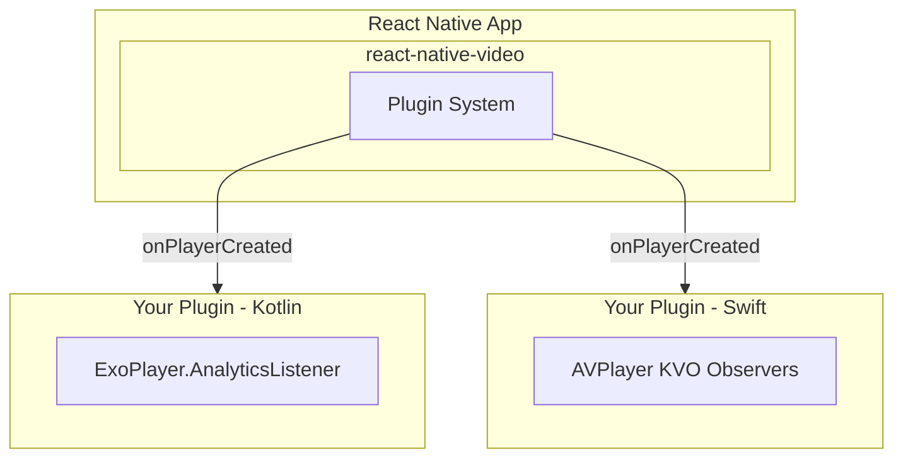

# Manual Analytics

Integrate your own analytics system using native plugins.

## Overview

Most analytics systems that track player data (e.g., bitrate, errors) can be integrated directly with ExoPlayer or AVPlayer. The [plugin system](../../plugins/plugins.mdx) allows for non-intrusive analytics integration with react-native-video. It should be implemented in native languages (Kotlin/Swift) to ensure efficiency.

## Architecture



## Implementation

### Android (Kotlin)

```kotlin
import androidx.annotation.OptIn
import androidx.media3.common.Format
import androidx.media3.common.PlaybackException
import androidx.media3.common.Player
import androidx.media3.common.util.UnstableApi
import androidx.media3.exoplayer.analytics.AnalyticsListener
import com.twg.video.core.plugins.NativeVideoPlayer
import com.twg.video.core.plugins.ReactNativeVideoPlugin
import java.lang.ref.WeakReference

@OptIn(UnstableApi::class)
class AnalyticsPlugin : ReactNativeVideoPlugin("MyAnalytics") {
    
    override fun onPlayerCreated(player: WeakReference<NativeVideoPlayer>) {
        val nativePlayer = player.get() ?: return
        val exoPlayer = nativePlayer.player
        
        exoPlayer.addAnalyticsListener(object : AnalyticsListener {
            override fun onBandwidthEstimate(
                eventTime: AnalyticsListener.EventTime,
                totalLoadTimeMs: Int,
                totalBytesLoaded: Long,
                bitrateEstimate: Long
            ) {
                trackMetric("bitrate", bitrateEstimate)
            }
            
            override fun onDroppedVideoFrames(
                eventTime: AnalyticsListener.EventTime,
                droppedFrames: Int,
                elapsedMs: Long
            ) {
                trackMetric("dropped_frames", droppedFrames)
            }
            
            override fun onVideoInputFormatChanged(
                eventTime: AnalyticsListener.EventTime,
                format: Format,
                decoderReuseDecision: Int?
            ) {
                trackEvent("quality_change", mapOf(
                    "width" to format.width,
                    "height" to format.height,
                    "bitrate" to format.bitrate
                ))
            }
            
            override fun onPlaybackStateChanged(
                eventTime: AnalyticsListener.EventTime,
                state: Int
            ) {
                when (state) {
                    Player.STATE_BUFFERING -> trackEvent("buffering_start")
                    Player.STATE_READY -> trackEvent("buffering_end")
                    Player.STATE_ENDED -> trackEvent("playback_complete")
                }
            }
            
            override fun onPlayerError(
                eventTime: AnalyticsListener.EventTime,
                error: PlaybackException
            ) {
                trackEvent("error", mapOf(
                    "code" to error.errorCode,
                    "message" to error.message
                ))
            }
        })
    }
    
    override fun onPlayerDestroyed(player: WeakReference<NativeVideoPlayer>) {
        flushAnalytics()
    }
    
    private fun trackEvent(name: String, params: Map<String, Any?> = emptyMap()) {
        // Send to your analytics backend
    }
    
    private fun trackMetric(name: String, value: Number) {
        // Send to your analytics backend
    }
    
    private fun flushAnalytics() {
        // Flush pending analytics
    }
}
```

### iOS (Swift)

```swift
import AVFoundation

class AnalyticsPlugin: ReactNativeVideoPlugin {
    
    // MARK: - Properties
    
    private weak var currentPlayer: AVPlayer?
    private var rateObserver: NSKeyValueObservation?
    private var statusObserver: NSKeyValueObservation?
    private var timeObserver: Any?
    
    // MARK: - Init
    
    init() {
        super.init(name: "MyAnalytics")
    }
    
    // MARK: - Plugin Lifecycle
    
    override func onPlayerCreated(player: Weak<NativeVideoPlayer>) {
        guard let nativePlayer = player.value else { return }
        currentPlayer = nativePlayer.player
        
        setupPlaybackObservers(for: nativePlayer.player)
        setupQualityTracking(for: nativePlayer.playerItem)
    }
    
    override func onPlayerDestroyed(player: Weak<NativeVideoPlayer>) {
        removeAllObservers()
        flushAnalytics()
    }
    
    // MARK: - Setup
    
    private func setupPlaybackObservers(for player: AVPlayer) {
        rateObserver = player.observe(\.rate) { [weak self] p, _ in
            self?.trackEvent(p.rate > 0 ? "play" : "pause")
        }
        
        statusObserver = player.observe(\.status) { [weak self] p, _ in
            if p.status == .readyToPlay {
                self?.trackEvent("ready")
            } else if p.status == .failed {
                self?.trackEvent("error", params: ["message": p.error?.localizedDescription ?? ""])
            }
        }
        
        timeObserver = player.addPeriodicTimeObserver(
            forInterval: CMTime(seconds: 10, preferredTimescale: 1),
            queue: .main
        ) { [weak self] time in
            self?.trackMetric("position", value: time.seconds)
        }
    }
    
    private func setupQualityTracking(for playerItem: AVPlayerItem?) {
        NotificationCenter.default.addObserver(
            self,
            selector: #selector(handleAccessLog),
            name: .AVPlayerItemNewAccessLogEntry,
            object: playerItem
        )
    }
    
    @objc private func handleAccessLog(_ notification: Notification) {
        guard let item = notification.object as? AVPlayerItem,
              let event = item.accessLog()?.events.last else { return }
        
        trackMetric("bitrate", value: event.indicatedBitrate)
        trackMetric("stalls", value: Double(event.numberOfStalls))
        trackMetric("dropped_frames", value: Double(event.numberOfDroppedVideoFrames))
    }
    
    private func removeAllObservers() {
        if let observer = timeObserver {
            currentPlayer?.removeTimeObserver(observer)
        }
        rateObserver?.invalidate()
        statusObserver?.invalidate()
        NotificationCenter.default.removeObserver(self)
        
        currentPlayer = nil
        timeObserver = nil
    }
    
    // MARK: - Analytics
    
    private func trackEvent(_ name: String, params: [String: Any] = [:]) {
        // Send to your analytics backend
    }
    
    private func trackMetric(_ name: String, value: Double) {
        // Send to your analytics backend
    }
    
    private func flushAnalytics() {
        // Flush pending analytics
    }
}
```

## Available Metrics

### Android (ExoPlayer AnalyticsListener)

| Event | Method | Data |
|-------|--------|------|
| Bitrate | `onBandwidthEstimate` | `bitrateEstimate` |
| Dropped frames | `onDroppedVideoFrames` | `droppedFrames`, `elapsedMs` |
| Quality change | `onVideoInputFormatChanged` | `format.width`, `format.height` |
| Buffering | `onPlaybackStateChanged` | `Player.STATE_BUFFERING` |
| Stall | `onStallStart` / `onStallEnd` | duration |
| Seek | `onSeekStarted` / `onSeekProcessed` | position |
| Error | `onPlayerError` | `errorCode`, `message` |

### iOS (AVPlayer)

| Metric | Source | Property |
|--------|--------|----------|
| Bitrate | `accessLog` | `indicatedBitrate` |
| Stalls | `accessLog` | `numberOfStalls` |
| Dropped frames | `accessLog` | `numberOfDroppedVideoFrames` |
| Bytes | `accessLog` | `numberOfBytesTransferred` |
| Playback status | KVO | `player.status` |
| Play/Pause | KVO | `player.rate` |
| Buffer | `playerItem` | `isPlaybackLikelyToKeepUp` |

## Registration

Plugins auto-register when instantiated. Create your plugin early in app lifecycle:

**Android** - `MainApplication.kt`:

```kotlin
class MainApplication : Application() {
    override fun onCreate() {
        super.onCreate()
        AnalyticsPlugin() // Auto-registers via init block
    }
}
```

**iOS** - `AppDelegate.swift`:

```swift
@main
class AppDelegate: UIResponder, UIApplicationDelegate {
    private var analyticsPlugin: AnalyticsPlugin?
    
    func application(
        _ application: UIApplication,
        didFinishLaunchingWithOptions launchOptions: [UIApplication.LaunchOptionsKey: Any]?
    ) -> Bool {
        analyticsPlugin = AnalyticsPlugin() // Auto-registers via init
        return true
    }
}
```

## See Also

- [Plugins](../../plugins/plugins.mdx) - Full plugin system documentation
- [Plugin Interface](../../plugins/interface.md) - Complete API reference
