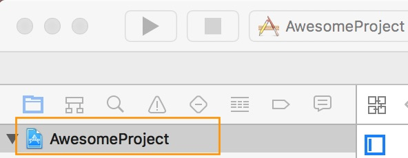
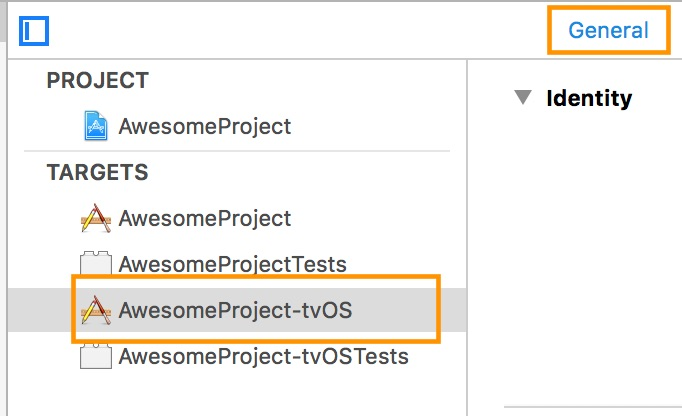
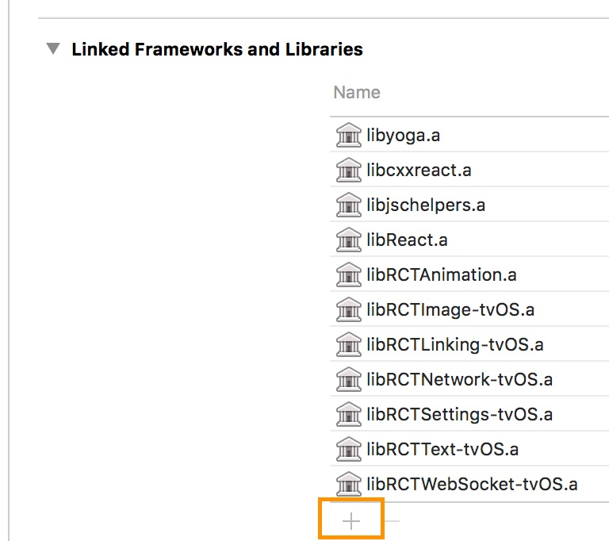
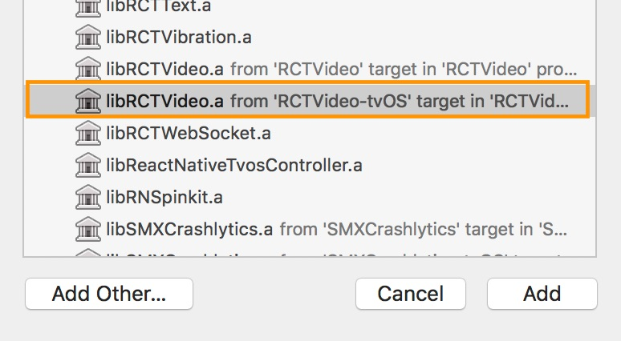

# Installation
Using npm:

```shell
npm install --save react-native-video
```

or using yarn:

```shell
yarn add react-native-video
```

Then follow the instructions for your platform to link react-native-video into your project

# Specific platform installation
<details>
<summary>iOS</summary>

## iOS

### Standard Method
Run `pod install` in the `ios` directory of your project.

⚠️ from version `6.0.0` the minimum iOS version required is `13.0`. For more information see [updating section](updating.md)

### Enable custom feature in podfile file

Samples available in sample app see [sample pod file](https://github.com/TheWidlarzGroup/react-native-video/blob/9c669a2d8a53df36773fd82ff0917280d0659bc7/examples/basic/ios/Podfile#L34)

#### Video caching

To enable Video caching usage, add following line in your podfile:
([more info here](other/caching.md))

```podfile
# enable Video caching
+ $RNVideoUseVideoCaching=true
```

#### Google IMA

Google IMA is the google SDK to support Client Side Ads Integration (CSAI), see [google documentation](https://developers.google.com/interactive-media-ads/docs/sdks/ios/client-side) for more information.

To enable google IMA usage define add following line in your podfile:
```podfile
$RNVideoUseGoogleIMA=true
```

**If you are using Expo you can use [expo plugin](other/expo.md) for it**

</details>
<details>
<summary>Android</summary>

## Android

From version >= 6.0.0, your application needs to have kotlin version >= 1.8.0

```:
buildscript {
    ...
    ext.kotlinVersion = '1.8.0',
    ext.compileSdkVersion = 34
    ext.targetSdkVersion = 34
    ...
}
```

### Enable custom feature in gradle file

**If you are using Expo you can use [expo plugin](other/expo.md) for it**

You can disable or enable the following features by setting the following variables in your `android/build.gradle` file:
- `useExoplayerIMA` - Enable Google IMA SDK (Ads support)
- `useExoplayerRtsp` - Enable RTSP support
- `useExoplayerSmoothStreaming` - Enable SmoothStreaming support
- `useExoplayerDash` - Enable Dash support
- `useExoplayerHls` - Enable HLS support

Each of these features enabled will increase the size of your APK, so only enable the features you need.
By default enabled features are: `useExoplayerSmoothStreaming`, `useExoplayerDash`, `useExoplayerHls`


Example:

```gradle
buildscript {
  ext {
    ...
    useExoplayerIMA = true
    useExoplayerRtsp = true
    useExoplayerSmoothStreaming = true
    useExoplayerDash = true
    useExoplayerHls = true
    ...
  }
}
```

See [sample app](https://github.com/TheWidlarzGroup/react-native-video/blob/9c669a2d8a53df36773fd82ff0917280d0659bc7/examples/basic/android/build.gradle#L14C5-L14C5)

</details>
<details>
<summary>Windows</summary>

## Windows

### Autolinking

**React Native Windows 0.63 and above**

Autolinking should automatically add react-native-video to your app.

### Manual Linking

**React Native Windows 0.62**

Make the following additions to the given files manually:

`windows\myapp.sln`

Add the _ReactNativeVideoCPP_ project to your solution (eg. `windows\myapp.sln`):

1. Open your solution in Visual Studio 2019
2. Right-click Solution icon in Solution Explorer > Add > Existing Project...
3. Select `node_modules\react-native-video\windows\ReactNativeVideoCPP\ReactNativeVideoCPP.vcxproj`

`windows\myapp\myapp.vcxproj`

Add a reference to _ReactNativeVideoCPP_ to your main application project (eg. `windows\myapp\myapp.vcxproj`):

1. Open your solution in Visual Studio 2019
2. Right-click main application project > Add > Reference...
3. Check _ReactNativeVideoCPP_ from Solution Projects

`pch.h`

Add `#include "winrt/ReactNativeVideoCPP.h"`.

`app.cpp`

Add `PackageProviders().Append(winrt::ReactNativeVideoCPP::ReactPackageProvider());` before `InitializeComponent();`.

**React Native Windows 0.61 and below**

Follow the manual linking instructions for React Native Windows 0.62 above, but substitute _ReactNativeVideoCPP61_ for _ReactNativeVideoCPP_.

</details>
<details>
<summary>tvOS</summary>

## tvOS

`react-native link react-native-video` doesn’t work properly with the tvOS target so we need to add the library manually.

First select your project in Xcode.



After that, select the tvOS target of your application and select « General » tab



Scroll to « Linked Frameworks and Libraries » and tap on the + button



Select RCTVideo-tvOS


</details>
</details>

<details>
<summary>visionOS</summary>

## visionOS
Run `pod install` in the `visionos` directory of your project

</details>
