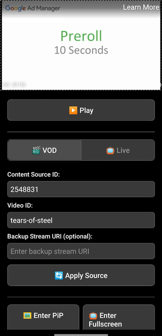

# Expo DAI Example

This is an Expo example app demonstrating Dynamic Ad Insertion (DAI) functionality with `react-native-video`. It supports both Video On Demand (VOD) and Live streaming scenarios.

## Features

- **VOD and Live DAI Support** – Test both Video On Demand and Live streaming with Dynamic Ad Insertion
- **Configurable DAI Settings** – Easily configure content source IDs, video IDs, asset keys, and backup stream URIs
- **Real-time Event Logging** – Monitor all video and ad events in real-time

## Demos

| iOS Demo | Android Demo |
|----------|--------------|
|  |  |

## Installation

This is a standard Expo prebuilt application. Follow these steps to get started:

1. **Install dependencies in the repository root:**

```bash
yarn install
```

2. **Install dependencies in the example directory:**

```bash
cd examples/expo-dai
yarn install
```

3. **Run on iOS:**

```bash
# Run the app
yarn ios
```

4. **Run on Android:**

```bash
yarn android
```

If Metro Bundler is not running, start it with:

```bash
yarn start
```

## Known Issues

### Google Sample Streams

To test midroll ads for the provided example, you need to provide your own DAI configuration. There is a known bug with Google's official sample streams where HLS VOD streams (like "Tears of Steel") stop playing around 1 minute 10 seconds due to missing chunks.

For more details, see the [Google IMA SDK forum discussion](https://groups.google.com/u/1/g/ima-sdk/c/UPkrJhy0jYg).

For official DAI sample streams and testing resources, see the [Google Ad Manager DAI sample streams documentation](https://developers.google.com/ad-manager/dynamic-ad-insertion/streams).

### Picture-in-Picture on iOS Simulators

Picture-in-Picture does not work on iOS simulators. The best way to test PiP functionality is on a real iOS device. While tablet simulators may work, they can be buggy and unreliable for PiP testing.

## Usage

1. **Configure DAI Settings:**
   - Select VOD or Live content type
   - Enter your DAI configuration:
     - For VOD: `contentSourceId` and `videoId`
     - For Live: `assetKey`
   - Optionally set a `backupStreamUri` for fallback
   - Tap "Apply Source" to load the stream

2. **Monitor Events:**
   - All video and ad events are logged in real-time
   - Use the debug toggle to pause/resume event streaming
   - Scroll through the event log to see detailed event information

3. **Control Playback:**
   - Use the built-in video controls or the custom control panel
   - Test Picture-in-Picture mode (requires real device on iOS)
   - Test fullscreen playback

## Configuration

The app is pre-configured with IMA SDK support in `app.json`. The configuration includes:

- IMA SDK extension enabled (`enableADSExtension: true`)
- ExoPlayer extensions for HLS, DASH, and other formats
- Native project settings for iOS and Android

You can modify the DAI configuration in the app's UI or by editing the default values in `App.tsx`.

